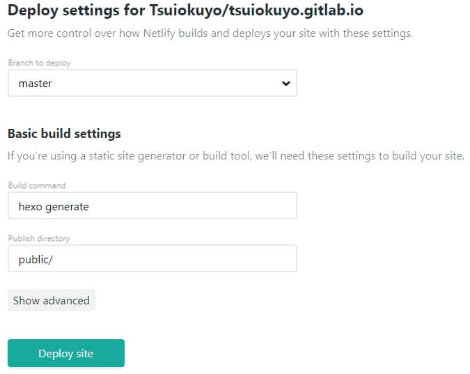
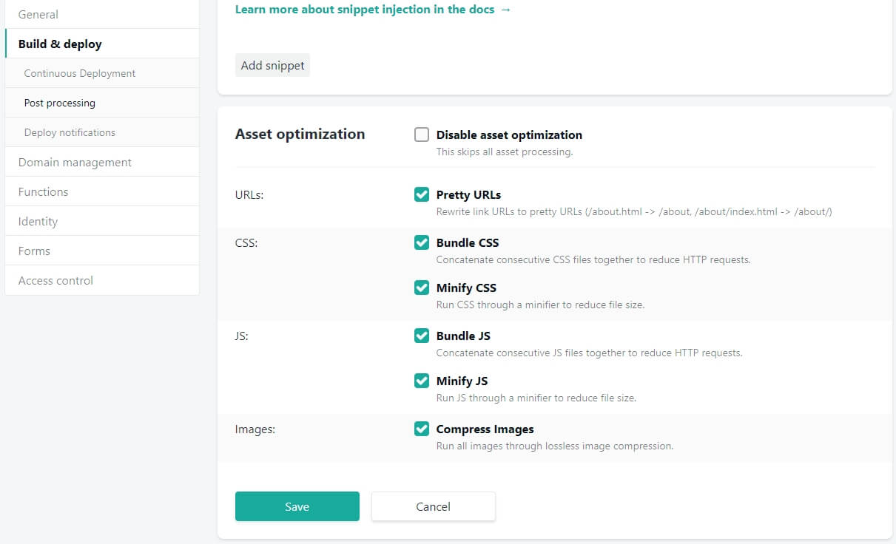
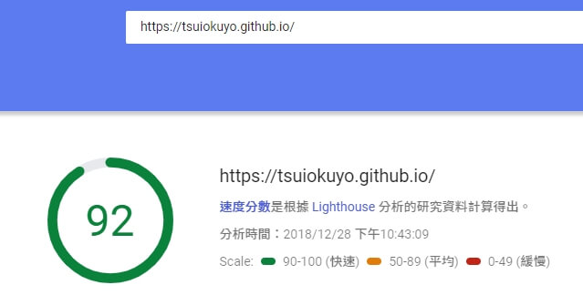
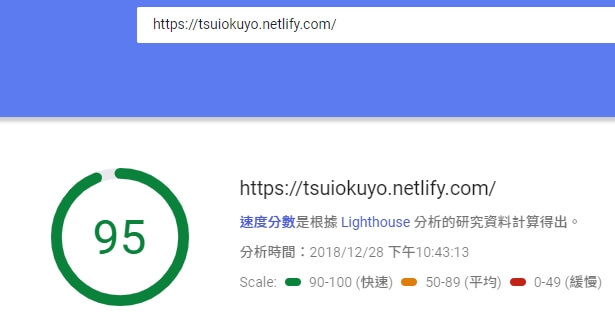
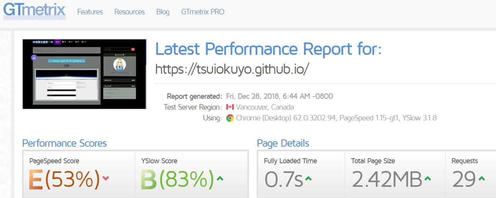
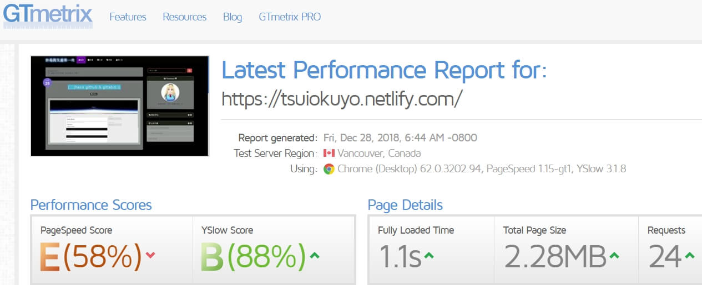
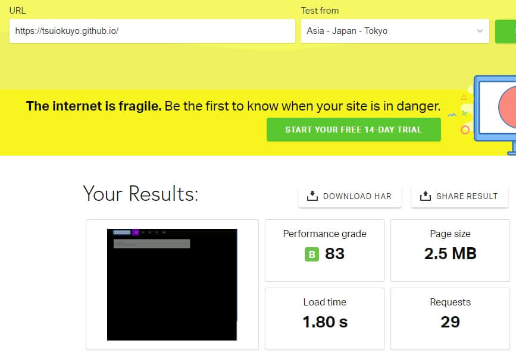
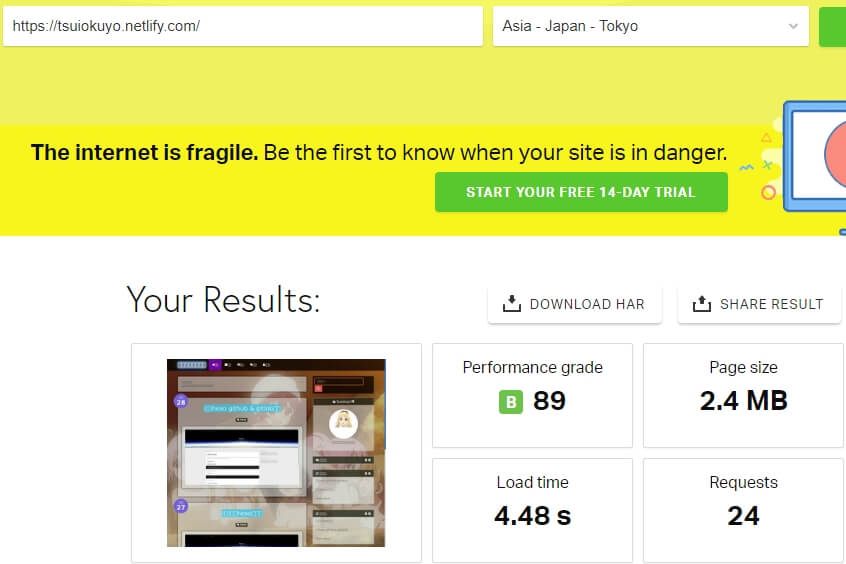

這是最後一篇了吧

登入netlify後

New site from Git -> gitlab 選擇hexo的project

基本上，應該都自動導入了

建立好了後，網站就生成了，

首先先改個網址名稱，

site settings ->Change site name

由於我沒有自己的domain所以不能使用自己的網址 只能使用tsuiokuyo.netlify.com，

再來是優化URLs、CSS、JS、Images等等。

再來往下，

開啟預渲染 Prerendering，

雖然好像非必要。

至此，我也不知道還能幹嘛了...。

由於是剛架好的，雖然多了CDN加速，不過目前差異應該不大，

所以稍微測了netlify跟github的速度測試，

整體來說netlify好像比較好，而且網站部屬更新的速度比github速度還快。

也許這不是最好的配置，不過我是覺得自己滿意就行了。

更新：另外Netlify還是有一些特定時候好使用的功能，如表單，以及程式碼注入等等，不過剛開始根本不會特意就是了，很多東西都是要後來摸索後發現也許需要才發現有用......，
順便一提，其實我在找Netlify提供的功能時，發現有關於Netlify架hexo的部分更詳細的文章，不過畢竟我當時是2018年中建的，幾乎沒啥中文教學，甚麼都看不懂><，所以非常的不詳細，雖然這只是藉口啦，但看到這篇文章我還是建議去參考其他人的會更好。(2020/02/25)

延伸閱讀：

[(一)架設hexo部落格](../9702c5d)

[(二)hexo github & gitlab推送](../1ced115b)
