雖然PPSSPP已經算很成熟了，但我還是喜歡用實機玩

<!--more-->

為了這篇文，還要特地截圖拍照，真有點麻煩

我個人的需求場景是，1080P的畫面，以及用xbox手把玩。

1. PSP部份我是透過ffmpeg用gdigrab 抓RemoteJoyLite畫面再用mpv接訊號

2. PSV部分是透過vita-udcd-uvc輸出，再用mpv接訊號

## 幾件事情必須先提

用來勸退的，不然最後覺得效果不好或不能用也只是浪費時間而已

- 對PSP實機還有興趣的人可以玩玩看，否則你還是用模擬器吧...

- 基本上對靜態畫面比較實用而已，因為我是為了玩AVG遊戲，
  
  除非遊戲被掌機壟斷，不然你還是買steam版或PS4(vita)版的吧。

- 黏在一起的東西，再怎麼放大還是會黏在一起，例如文字，糊的還是糊的。

- 無論如何都很難比上模擬器畫面，畢竟人家是從**源頭**材質貼圖去縮放，我只是打算實時畫面放大而已。

- 需要懂得使用小黑盒，cmd或powershell都行。

- PSP需要搭配RemoteJoyLite v0.19，中國曾經有出過修改的Remote Joy Lite增強版
  但現今已找不到資源，因此只能用其他版本，v0.20a我有點問題，因此用v0.19

- 需要一條AUX音源線，推薦LINDY公對公 200元左右，不玩時可以拿去換耳機線...。

- PSP需要mini usb線。

- PSV需要裝X1Vita(xbox手把插件)、vita-udcd-uvc。

- PSV需要micro usb線、

- PC端需要MPV播放器及一堆著色器(濾鏡)，不過其實其他播放器也行，搭配madVR之類的，只要你會設定以及輸入掌機畫面。

- 我PSP使用的著色器及順序蠻多的，PSP原生畫面只有272P的解析度，其實我這樣弄還不見得打得贏PPSSPP，畢竟我不是專業的。

- PSV同上說法，打不贏PS4畫質，不過PSV原生畫面接近544P的解析度。

而既然上面都看完了，

## 先來分享失敗歷程

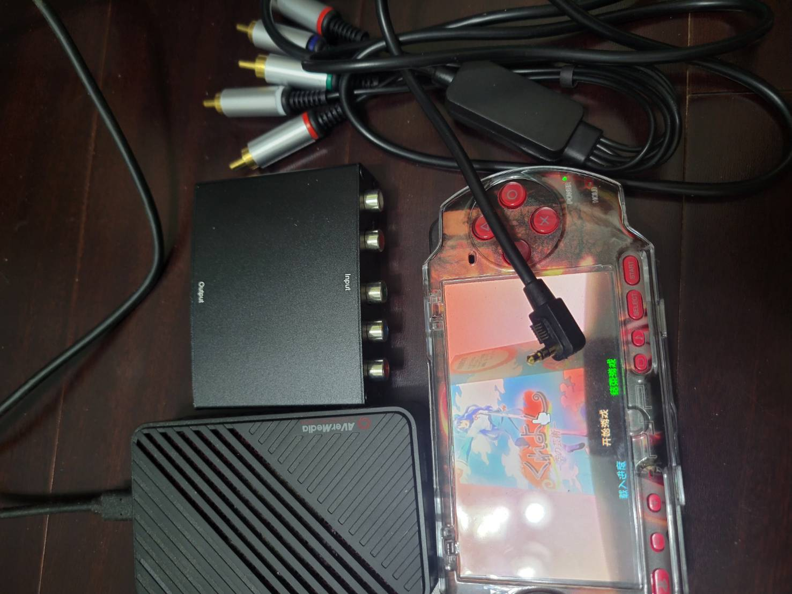

左上是圓剛GC553 Live Gamer ULTRA 4Kp60 HDR實況擷取盒

中上是色差端子HDMI轉換盒，右邊是PSP專用的色差端子

最初當然是想弄原生的方法，端子轉HDMI，

PSP在網拍有兩種訊號端子，AV端子及色差端子，

其中色差端子的畫質一定比AV端子好，因為色差端子的訊號已經很接近HDMI了

因此方案是PSP -> 色差端子 -> 色差HDMI轉換盒 -> 圓剛GC553擷取盒 -> 電腦  -> MPV

這方案比買一台PSP還貴，然後要更多線跟變壓器，最後當然是白忙一場，繳了學費，不過也因此確定了這樣畫質沒有比較好，而且手把好像也連不上，因此才有這篇。

# 

## PSP部分

### PSP用著色器後的遊戲畫面比對

第一張為遊戲畫面，第二張為開啟著色器遊戲畫面，**用右鍵開原圖比對**

在第一張圖說明一下瑕疵及原因

1.

由上方第兩張(開著色器)可發現髮絲不太自然，當然不是每個CG都有問題，只是剛好看到一張比較明顯的。

畢竟我要的是通用的升頻方案，不太可能為了特定畫面去調整著色器，有時候弄A方案，結果導致某些地方瑕疵非常礙眼，或某些遊戲的文字反而不好閱讀等等。

例如下面這張髮絲自然度感覺似乎比較好一點了，但其實也是犧牲了一點東西

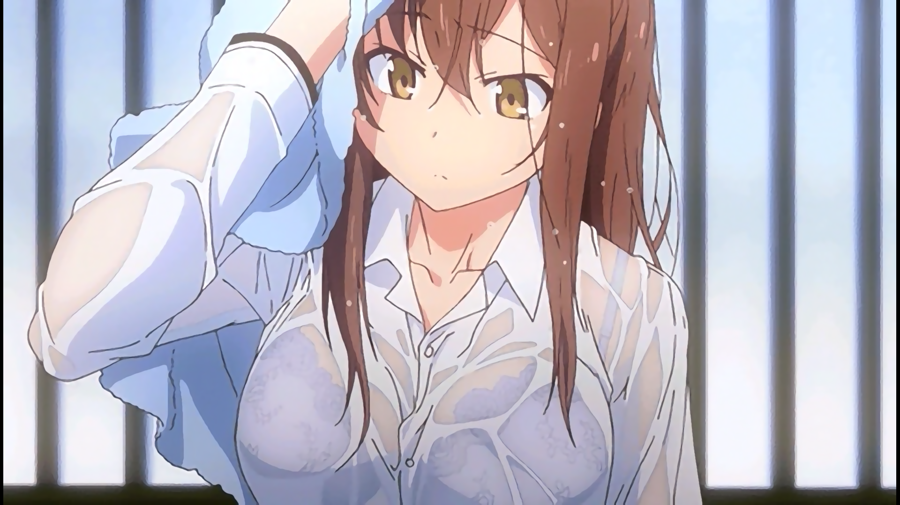

順帶一提，櫻花莊有PSV版本，只不過是日文版，而PSV版CG圖會比PSP畫質還要好一點

下面這張則是以**PSV**開著色器執行**PSP**版遊戲，而非直接用PSV版畫面

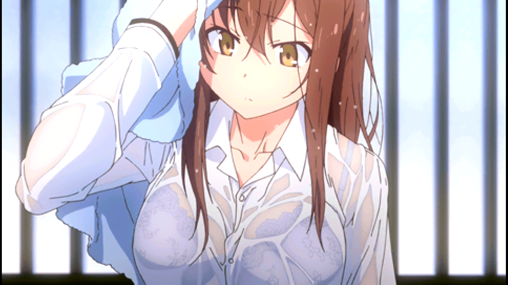

畢竟如果想要有細節都有的CG圖，那麼只能如下面這張進行後處理了，這就不是目前的即時運算升頻能辦到的事情了...

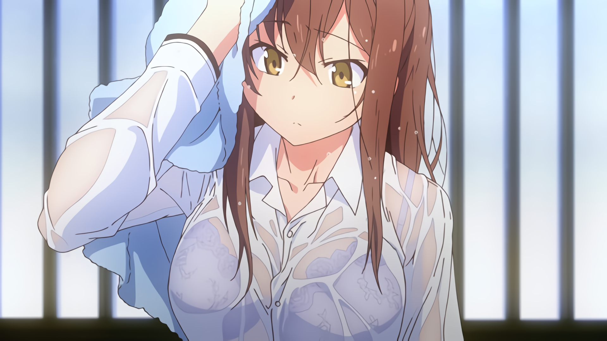

2.

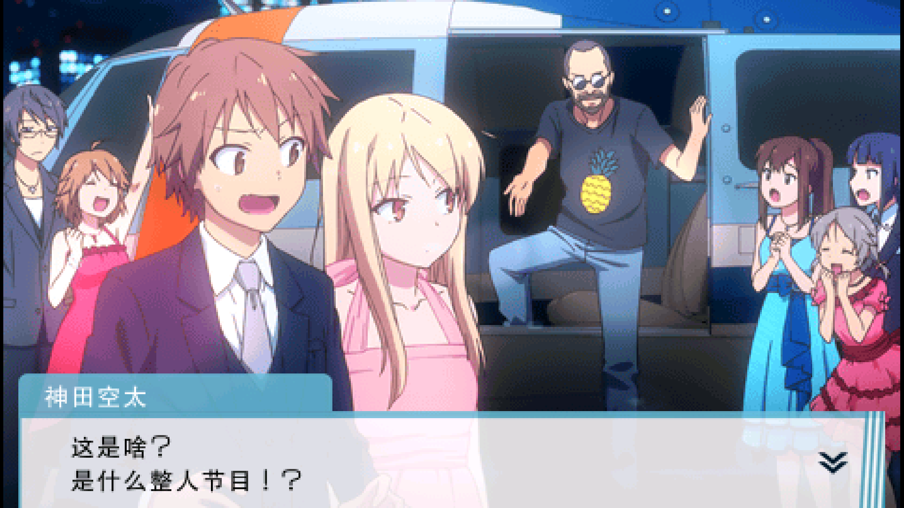

3.

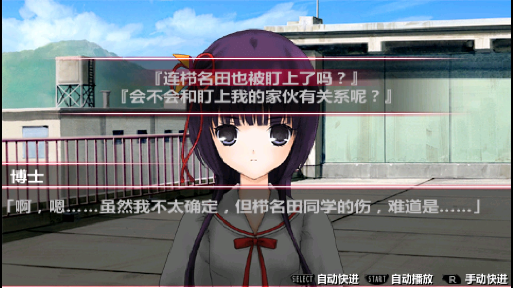

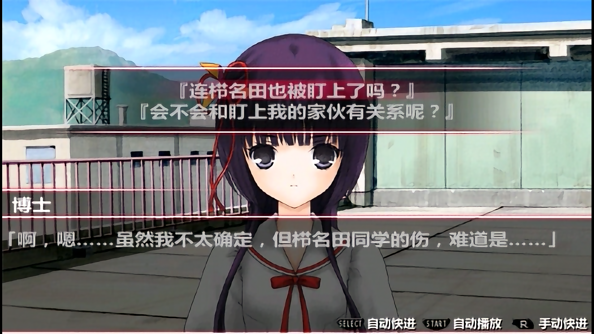

4.

下面這張則是以**PSV**開著色器執行PSP遊戲

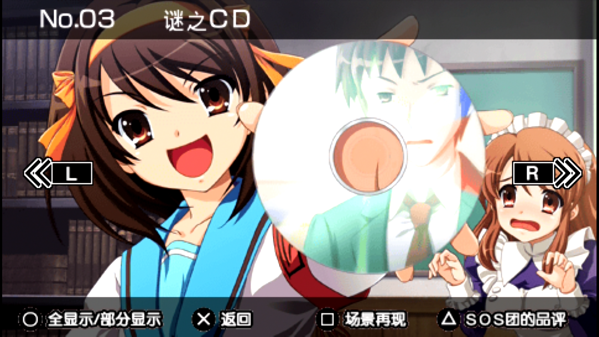

5.

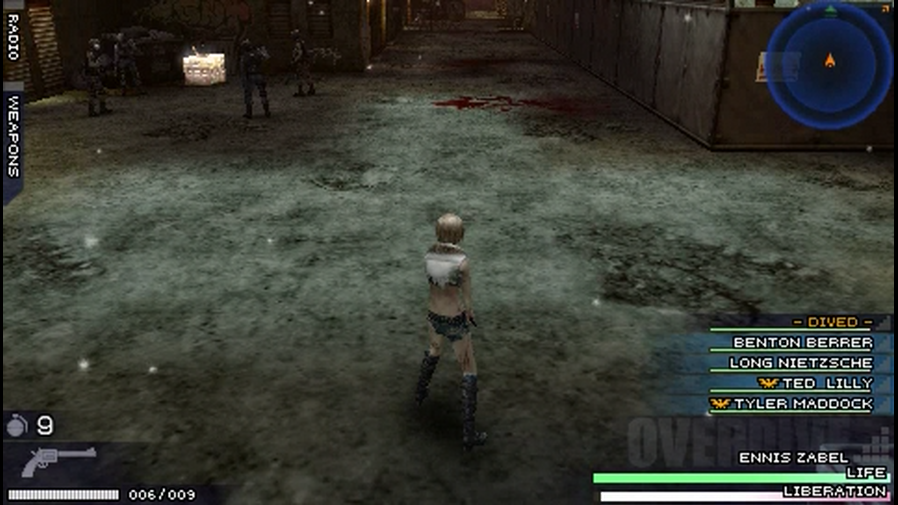

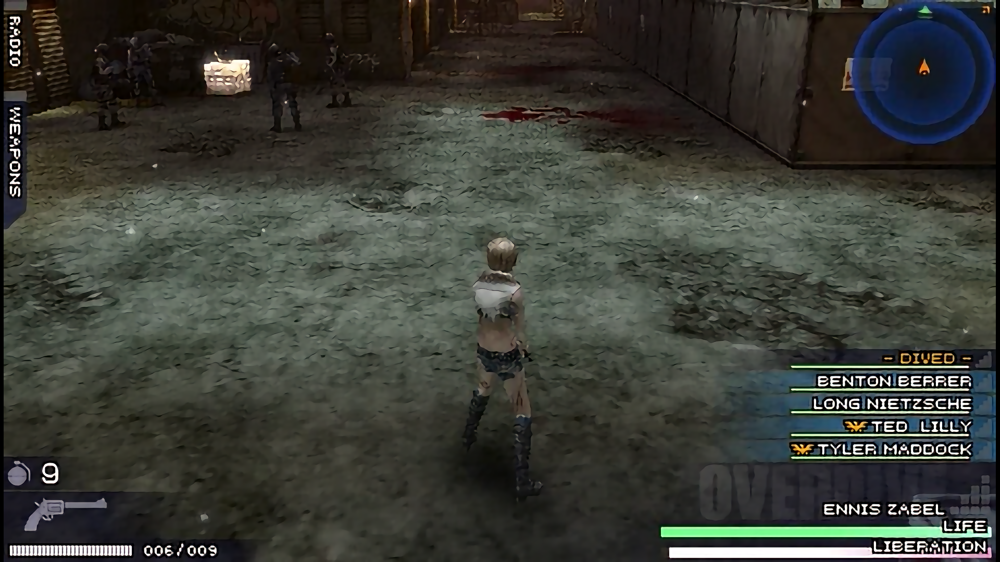

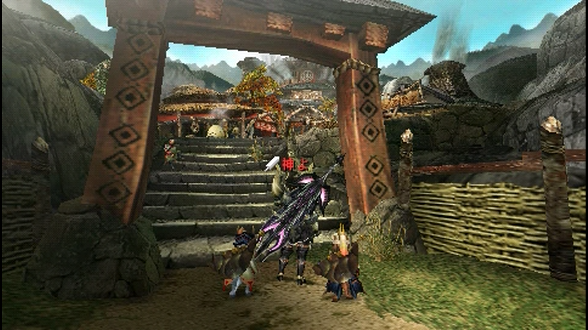

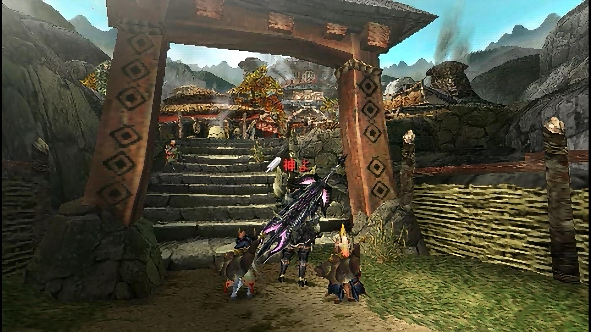

其實就是銳化跟一些處理，畢竟原本的解析度就那樣，細節不會無中生有，畫面上沒有的東西放大還是沒有，銳化越強，畫面瑕疵也會相對增加，處理會更加麻煩。

當然還有其他即時運算的放大演算法可以玩，不過很麻煩所以就算了。

然後就是實際操作步驟了

### 1. PSP 接上mini usb 透過RemoteJoyLite 將畫面輸出到電腦

### 2. 公對公音源線輸出音訊至電腦

### 3. 用PC端推送畫面

傳輸協定有好幾種，大概就是rtp、udp、tcp、http、rtsp等等，

而我是用rtsp，畢竟rtsp比較穩定，只不過需要另外在開伺服器，

所以此處擇一即可。

#### 先提rtp

首先在小黑盒中輸入

<code>ffmpeg -f gdigrab -framerate 60 -i title="RemoteJoyLite Ver0.19" -vcodec libx264 -pix_fmt yuv420p -tune zerolatency -preset ultrafast -f rtp_mpegts rtp://192.168.88.250:9998 -vsync 2 -fflags +discardcorrupt</code>

簡單的說就是透過gdigrab抓畫面並推送到區網的192.168.88.250:9998這個port

參數詳情要去爬ffmpeg的documentation，我弄完沒多久就已經忘光了

其中title部分要看你的RemoteJoyLite的名稱

rtp部分則為自己區網的IP，直接用127.0.0.1:任何port 也行

當然想用udp、tcp、http、也行，但可能穩定性較差，就是可能掉幀等等。

#### 另外是rtsp部分

server我是使用

 [GitHub - aler9/mediamtx: Also known as rtsp-simple-server. ready-to-use RTSP / RTMP / LL-HLS / WebRTC server and proxy that allows to read, publish and proxy video and audio streams.](https://github.com/aler9/mediamtx)

下載執行即用，不用再另外設定甚麼

而rtsp的參數則是

<code>ffmpeg -f gdigrab -framerate 60 -i title="RemoteJoyLite Ver0.19" -vcodec libx264 -pix_fmt yuv420p -tune zerolatency -preset ultrafast -f rtsp rtsp://localhost:8554/live -vsync 2  -fflags +discardcorrupt</code>

與上方的rtp就差在指定rtsp而已

### 4. MPV接收畫面部分

#### rtp接收部分

到mpv的根目錄底下開小黑盒，並輸入

<code>./mpv rtp://192.168.88.250:9998 --no-border --no-cache --profile=low-latency --deband --untimed --vd-lavc-threads=1 --demuxer-lavf-o-add=rtbufsize=2147.48M --vd-lavc-fast=yes --vd-lavc-o=gpu=1 --ad-lavc-downmix=yes --audio-buffer=0 --video-latency-hacks=yes</code>

簡單的說就是用mpv去接收9998 port的東西

這些參數則要去爬mpv的documentation ，

總之只要確認ip跟ffmpeg推送的ip是一樣的即可

#### rtsp接收部分

<code>./mpv rtsp://localhost:8554/live --no-border --no-cache --profile=low-latency --deband --untimed --vd-lavc-threads=1 --demuxer-lavf-o-add=rtbufsize=2147.48M --vd-lavc-fast=yes --vd-lavc-o=gpu=1 --ad-lavc-downmix=yes --audio-buffer=0 --video-latency-hacks=yes</code>

基本上也是改成rtsp跟路徑而已，網址路徑要改成相同的其實也沒差，只不過我比較懶，直接用預設的而已。

基本上這樣 mpv就能看到PSP的畫面了

### 5. 開啟著色器

我PSP方案使用的著色器及開啟順序，畢竟PSP原生畫面只有272P的解析度，其實我這樣弄還不見得打得贏PPSSPP，畢竟我不是專業的。

著色器開啟的順序會影響到畫面

基本上就是放大跟線條重構，不過當然著色器還有很多變種及算法，

要求很簡單，所以只用anime4K而已。

放大演算法詳情可參考這篇，然後再來打臉我的用法QQ

[Mathematically Evaluating mpv's Upscaling Algorithms - A study of performance and quality](https://artoriuz.github.io/blog/mpv_upscaling.html)

畢竟當時的想法已經忘了。

1. FSRCNNX_x2_8-0-4-1_LineArt.glsl

2. Anime4K_Clamp_Highlights.glsl

3. Anime4K_Restore_CNN_Soft_M.glsl

4. Anime4K_Upscale_CNN_x2_M.glsl

5. Anime4K_AutoDownscalePre_x2.glsl

6. Anime4K_AutoDownscalePre_x4.glsl

7. Anime4K_Restore_CNN_Soft_S.glsl

8. Anime4K_Upscale_CNN_x2_S.glsl

9. Anime4K_Restore_GAN_UUL.glsl

10. Anime4K_Upscale_GAN_x3_VL.glsl

11. Anime4K_Restore_CNN_Soft_M.glsl

12. Anime4K_Upscale_CNN_x2_M.glsl

### 6. xbox手把連接

手把部分則是透過RemoteJoyLite去操控，因此不用特別弄甚麼

總之PSP部分我目前的做法就是這樣

## PSV部分

PSV就簡單多了，因為不用再推送畫面，插件幫我們完事了

### PSV用著色器後的遊戲畫面比對

第一張為遊戲畫面，第二張為開啟著色器遊戲畫面，**用右鍵開原圖比對**

1.

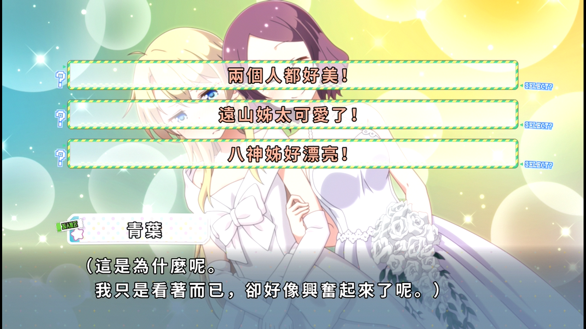

2.

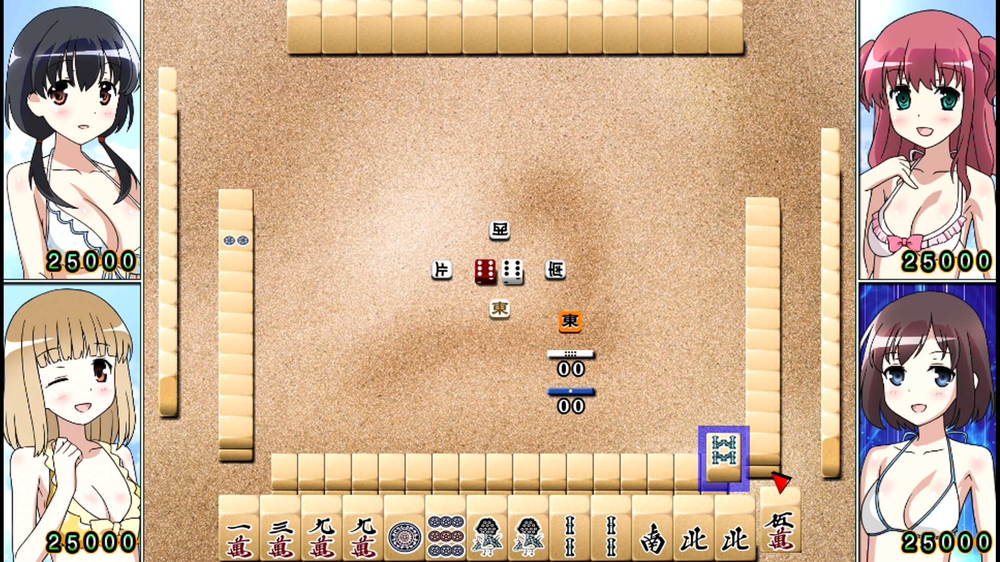

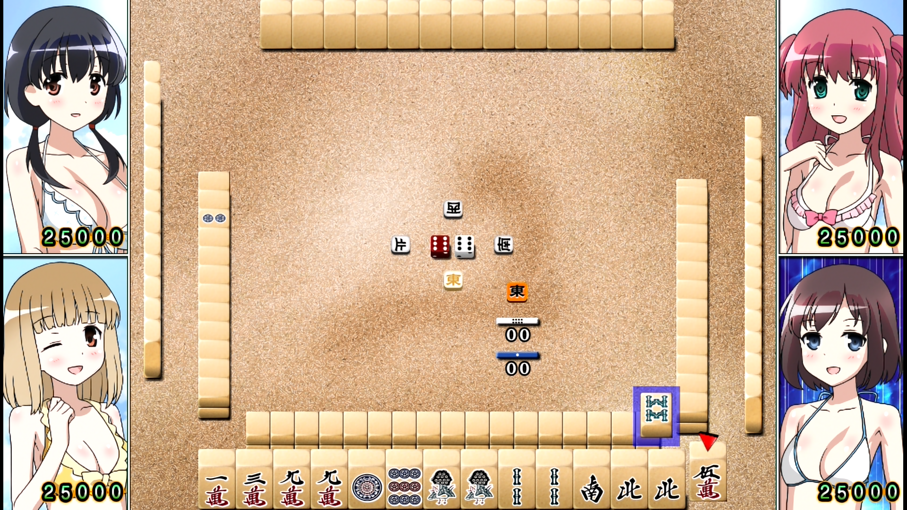

3.

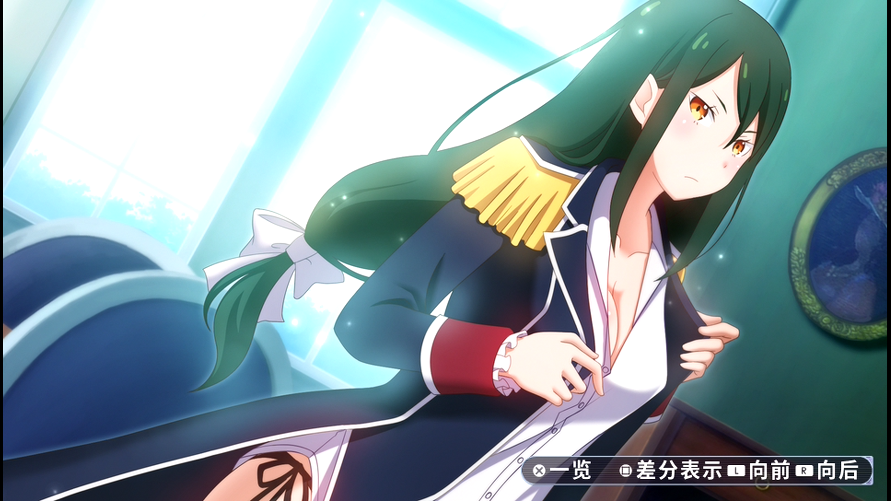

4.

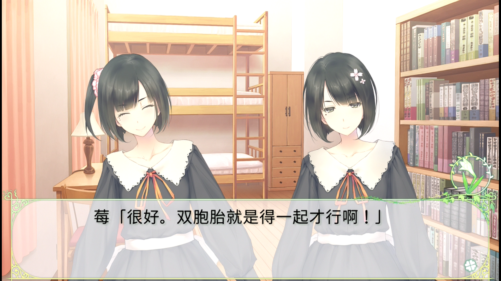

5.

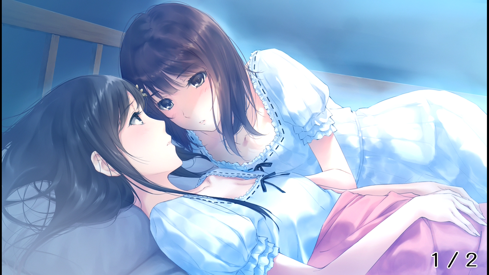

6.

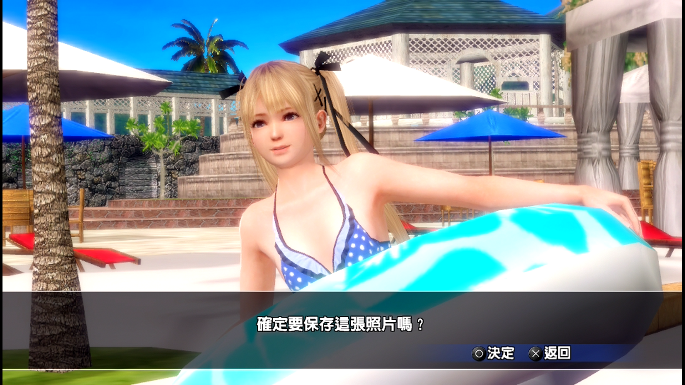

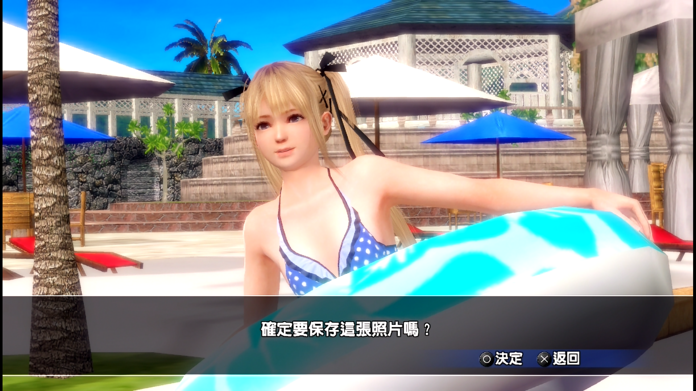

### 1. 安裝X1Vita(xbox手把插件)、vita-udcd-uvc(畫面輸出)

### 2. PSV用micro usb跟公對公音源線連接至PC

### 3. MPV接收畫面

因為有vita-udcd-uvc這個插件會直接輸出畫面，

所以直接到mpv的根目錄底下開小黑盒，輸入

<code>./mpv av://dshow:video="PSVita" --no-border --no-cache --profile=low-latency --untimed --vd-lavc-threads=1 --deband --demuxer-lavf-o-add=rtbufsize=2147.48M --vd-lavc-fast=yes vd-lavc-o=gpu=1 --ad-lavc-downmix=yes --audio-buffer=0 --video-latency-hacks=yes</code>

MPV就會接收到PSV畫面了

而詳細參數一樣去mpv documentation自行爬文...

### 4. 開啟著色器，順序如下

1. FSRCNNX_x2_8-0-4-1_LineArt.glsl

2. Anime4K_Clamp_Highlights.glsl

3. Anime4K_Restore_CNN_Soft_M.glsl

4. Anime4K_Upscale_CNN_x2_M.glsl

5. Anime4K_AutoDownscalePre_x2.glsl

6. Anime4K_AutoDownscalePre_x4.glsl

7. Anime4K_Upscale_CNN_x2_S.glsl

### 5. 手把連接

因為有安裝X1Vita插件，因此直接用xbox手把內建的藍芽去配對PSV，

而手把不可接micro usb到電腦上，

另外要記得的是與PSV斷連接後，xbox手把每次都要手動重新連接到PSV，簡單的說就是藍芽沒辦法自動配對連線

## 結論

除非少數沒有被移植的作品必須在這兩個平台上玩，否則你還是買在其他平台的遊戲吧。

因為PS4跟STEAM版的畫質一定大於VITA跟PSP的。

不過VITA的AVG遊戲，如果沒提，基本上很難看出來是544P的畫質

PSP部分是因為我有實機，為何我還要去玩模擬器呢，因此才萌生這篇文章

這想法大概就是跟，我有手機為何還要用模擬器玩手遊是一樣的道理......。

而VITA部分，我個人有三個原因，STEAM沒推出，我沒有PS4、steam沒買那款遊戲。

