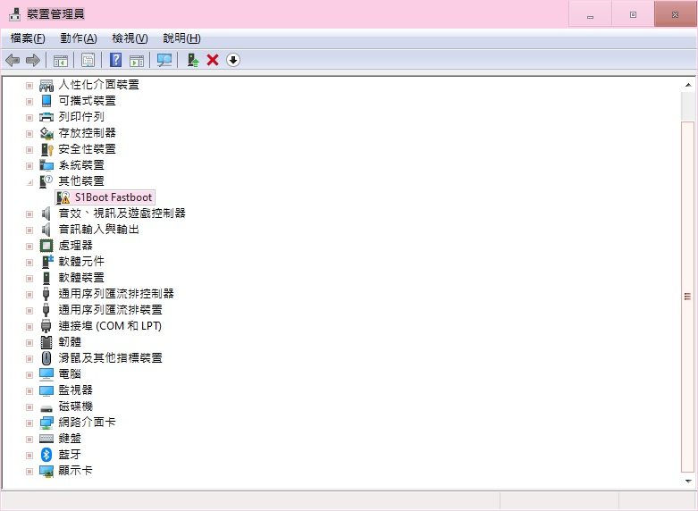
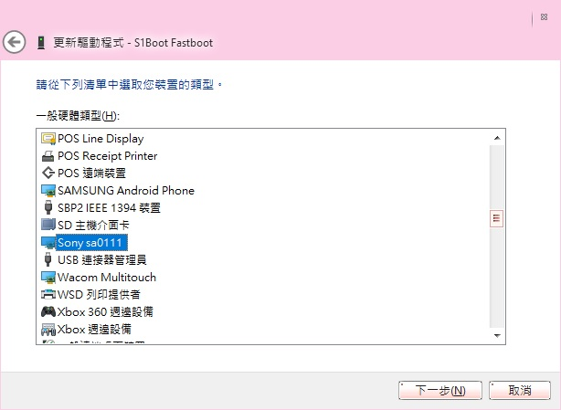
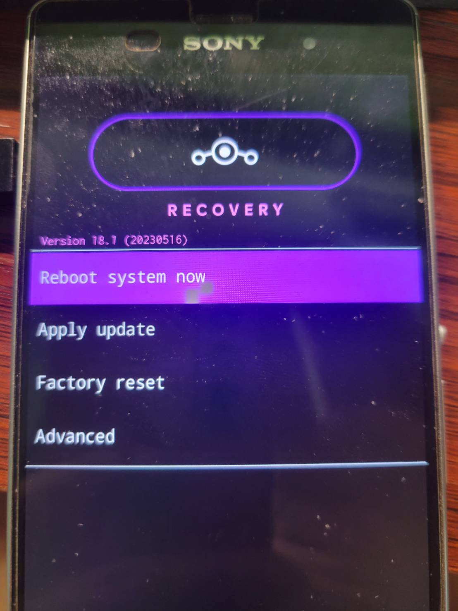

Z3 最後的更新 android 6的版本太低了，有些東西不能用

而且我也需要root，那只好來刷機了

<!-- more -->

<!--more-->

因為沒甚麼好圖文的，畢竟現在不像以前一樣隨便就變磚，

因此基本上都是字啦，文章沒有特別調整過，因為格式跑掉了，截圖也被清掉了...，


反正官方就有教學了，大不了就看官方的吧

這裡的官方是指LineageOS團隊

[Install LineageOS on z3 | LineageOS Wiki](https://wiki.lineageos.org/devices/z3/install)

只是官方沒有提供root方法及問題解法就是了

LineageOS 18.1 為android 11

[[OFFICIAL] LineageOS 18.1 for D6603 Xperia Z3 | XDA Forums](https://forum.xda-developers.com/t/official-lineageos-18-1-for-d6603-xperia-z3.4309509/)

[Info about z3 | LineageOS Wiki](https://wiki.lineageos.org/devices/z3/#supported-models)

版本號於國外為D6603，而台灣應該都是D6653

差別在於通訊頻段，Z3我只會用wifi而已，所以無所謂

因為前一次的淘寶買電池的給背蓋防水膠不好，背蓋已經鬆了，不可能帶出門了

所有貴重資料請先備份到電腦或其他地方

因為資料會全清掉

需要的東西

ROM包及recovery.img，boot.img不需要

[LineageOS Downloads](https://download.lineageos.org/devices/z3/builds)

[Google apps | LineageOS Wiki](https://wiki.lineageos.org/gapps)

從google下載 `adb`和`fastboot`

https://dl.google.com/android/repository/platform-tools-latest-windows.zip

環境變數詳細設定請看這邊

[Using ADB and fastboot | LineageOS Wiki](https://wiki.lineageos.org/adb_fastboot_guide)

不過我懶得設定環境變量，所以就不另外說了，反正上面有文章。

我都是直接從目錄中開小黑盒直接用，

一般使用者有三種開啟方法，

1. shift+右鍵 在此處打開powershell視窗

2. 資料夾上方的路徑列直接打cmd

3. 直接在右鍵顯示 在終端開啟 不過這個我忘記怎麼設定了

LineageOS抓的兩個ZIP包跟fastboot放一起，到時候就不用打路徑了

zip的檔名改短一點，例如rom.zip及gapp.zip，

不然之後刷進去的時候可能會因為特殊符號而錯誤

*手機*

首先到關於手機->軟件版本 點個10次開啟開發人員選項

然後到開發選項開啟USB偵錯

插上micro usb連接電腦及接受usb偵錯連接

*電腦*

在小黑盒輸入

adb shell getprop ro.build.display.id

先確認版本號為23.5.A.1.291，

如果版本號不同則需要再從flashtool刷成23.5.A.1.291

*手機*

再來確認是否能BL解鎖，不過同一個型號基本上都一樣啦

在撥號欄位輸入`*#*#7378423#*#*`

`service info`>`configuration`>

`rooting status`

確認

`Bootloader unlock allowed: Yes`

然後去關於手機 > 狀態 IMEI資訊

共15碼記下來

*電腦*

去SONY的網站生成解鎖編號

https://developer.sony.com/develop/open-devices/get-started/unlock-bootloader/#unlock-code

拉到最下面選擇Z3型號，輸入IMEI會生成解鎖序號

小黑盒輸入

`fastboot devices`

確認電腦是否有抓到手機

如果輸入後**甚麼都沒有**代表沒抓到手機(沒驅動)

否則會顯示出手機序號

List of devices attached
XXXXXXXXXX <狀態>

去sony官網抓Z3驅動

https://developer.sony.com/file/download/xperia-z3-driver/

然後就是到裝置管理員->其他裝置->驚嘆號



更新驅動程式

瀏覽電腦上的驅動程式->設定好路徑讓他抓即可，

如果倒楣裝不上去的話

就去抓好的drive中找sa0111adb.inf右鍵安裝，saXXXX會根據型號而有不同數字，

總之Z3就是0111

再回到上述地點 讓我從電腦上可用的驅動程式清單中挑選



安裝完成後輸入

```
adb reboot bootloader
```

如果是顯示wait for device則驅動還是沒安裝好

否則手機會自動關機，然後會看到左上角通知燈變藍色燈，

順帶一提，不知道是我手機問題還是怎樣，這個藍色黯淡到還以為沒發光...

或是關機後按住音量鍵上插入傳輸線也是一樣的效果

總之就是會進入快速啟動狀態

再來就是要解鎖手機了，小黑盒輸入上方在sony生成的解鎖序號

```
fastboot oem unlock <解鎖序號>
```

這時如果你又倒楣跳出

FAILED (remote: Incorrect format for unlock data. Should be on the form "0x)
finished. total time: 0.006s

則要在解鎖序號前方增加0x

舉例

fastboot oem unlock 0xA12345678901234B

若沒問題則顯示

OKAY [ 1.153s]
finished. total time: 1.154s

此時已解鎖完成。

*手機*

再來請拔掉傳輸線並重開機，由於全部重設所以開機會久一點

然後我就發現Z3上要用來圖文說明用的截圖就沒了...

回到關於手機->軟件版本 點個10次開啟開發人員選項

打開usb除錯

*電腦*

```
adb reboot bootloader
```

亮起藍燈後

刷入recovery

```
fastboot flash recovery recovery.img
```

*手機*

拔掉傳輸線 然後音量鍵下+電源鍵 直到震動一下放開

來開機進到recovery模式



進去後要用音量鍵來控制上下 電源鍵進入

**Factory Reset**，然後點擊**Format data / factory reset**

雙清後 移到最上面的返回鍵返回

如果雙清後還沒刷ROM包就不小心關機進入系統，因為沒系統所以開機會卡住

這時要電源鍵+音量鍵上強制關機，然後音量鍵下+電源鍵開機回到recovery模式

然後到apply update-> apply from ADB 啟動

*電腦*

`adb sideload rom.zip`

安裝rom

如果出問題大概會跳出三種狀況

1. error: closed

那就是還沒開adb

2. error: protocol fault (no status)

用adb devices確認是否有序號

3. error: device unauthorized. Please check the confirmation dialog on your device.

在手機上會顯示adb版本過低...

如果遇到第3點，可輸入

`adb version`

確認adb版本 如果低於1.0.32那就是不行，代表目前抓到的是舊版adb

則要去把舊版的adb移除，也許也能把舊版的adb環境變數的路徑移除就好了

如果正常則會顯示

serving: 'filename.zip' (~13%)

adb.exe: sideload requires an argument

再來就是安裝google相關套件

步驟同上

`adb sideload gapp.zip`

*手機*

大概到47%會卡住，因為驗證問題而顯示是否安裝

當然選yes了。

如果需要root

可到[GitHub - topjohnwu/Magisk: The Magic Mask for Android](https://github.com/topjohnwu/Magisk)

下載apk檔案後改成zip後與上方一樣的做法刷進去，

中途會顯示版本不符還是甚麼的忘記了，

要選yes安裝。

而如果開機後之後才想root 也能透過recover刷進去

apply update -> choose from inrernal storage

其實我覺得 原先抓rom的Download builds 那邊

boot.img可能就是已經刷好的，但不確定也懶得去用...

都做好之後到advanced選power off

如果google app版本安裝錯誤關機前會在提示你一次

然後就是重開機了

至此刷機結束

開機要等待5~10分鐘左右吧

然後就是正常開機設定流程了

如果root導致一堆東西開不了，那麼就安裝這個模組吧

[Releases · LSPosed/LSPosed.github.io · GitHub](https://github.com/LSPosed/LSPosed.github.io/releases)
