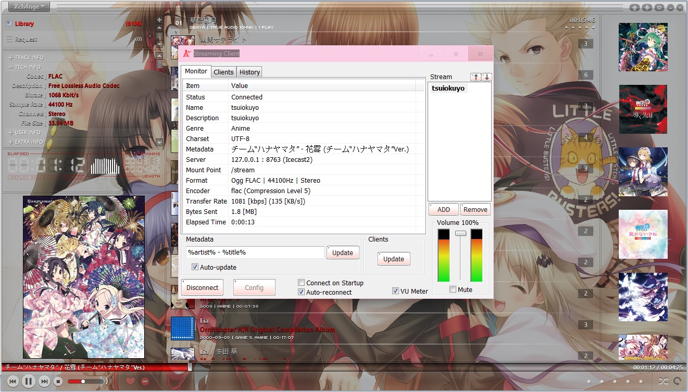
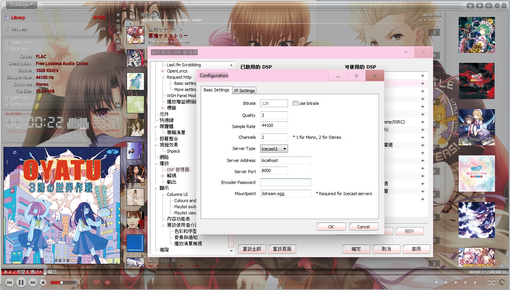
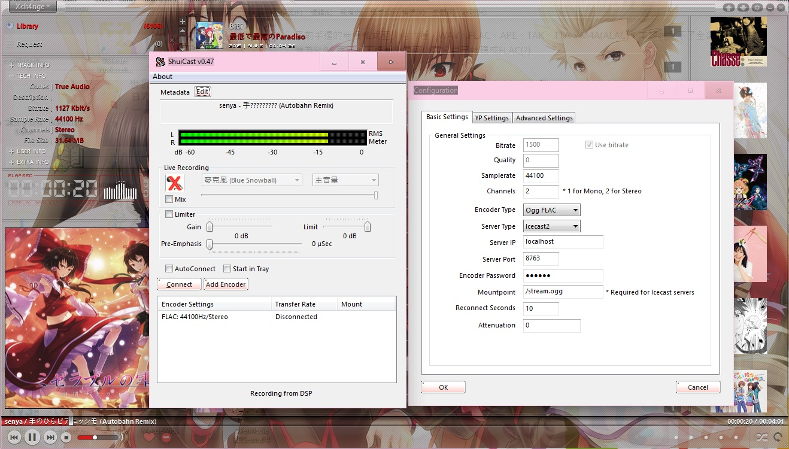
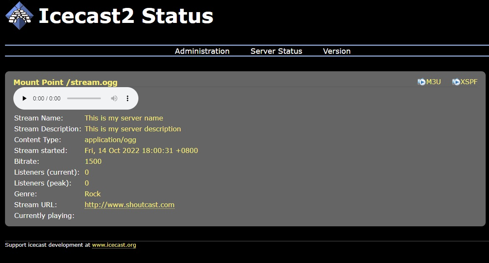
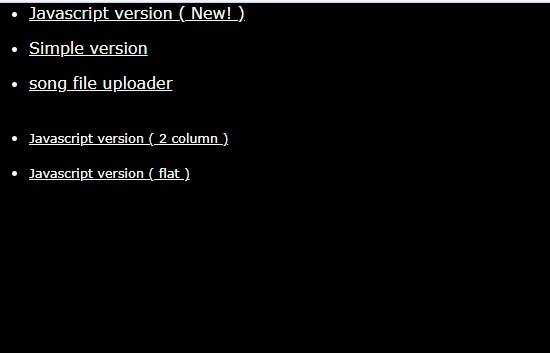
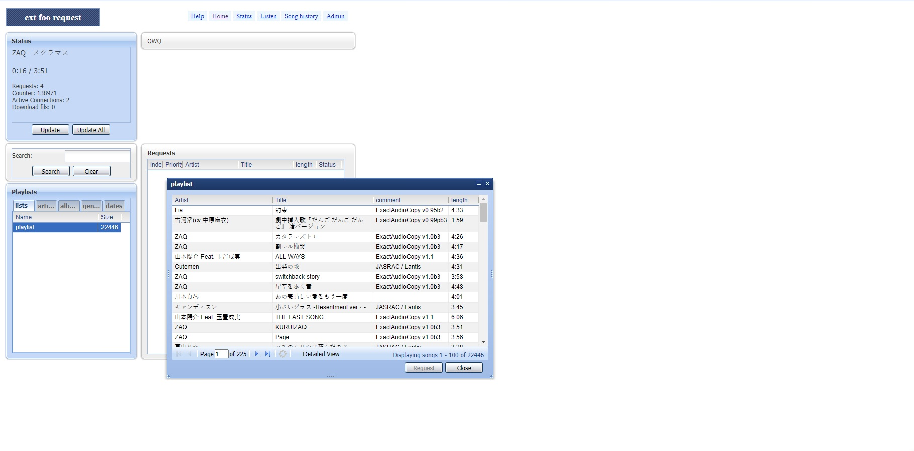
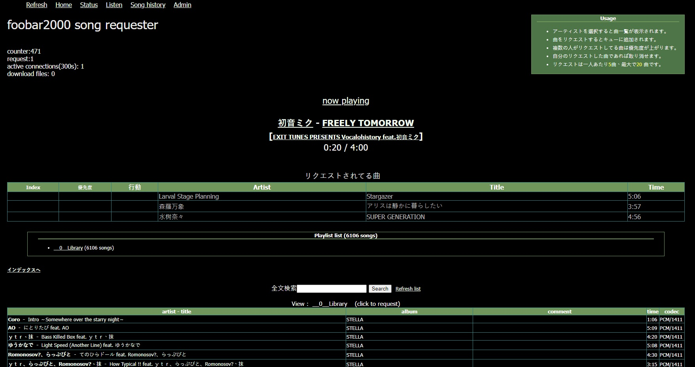
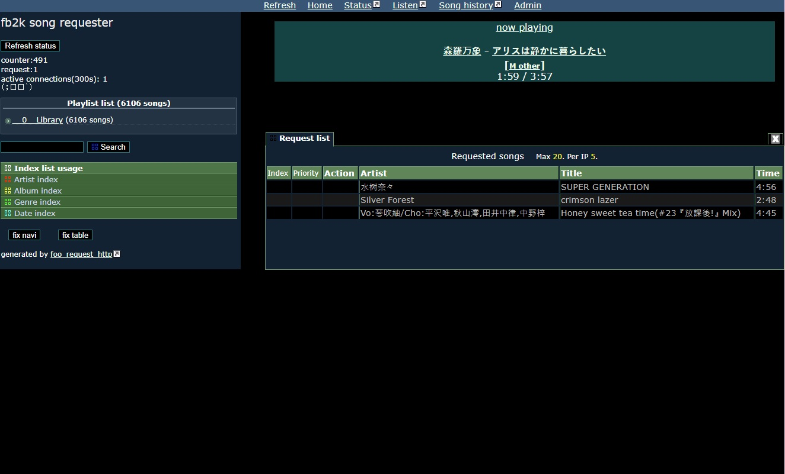
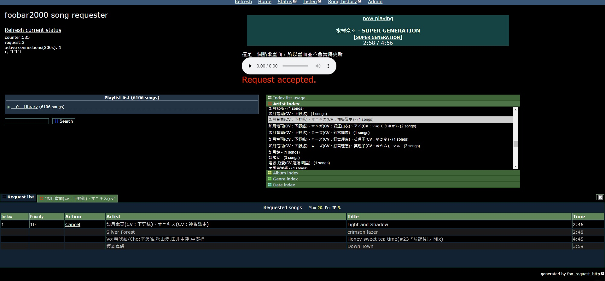
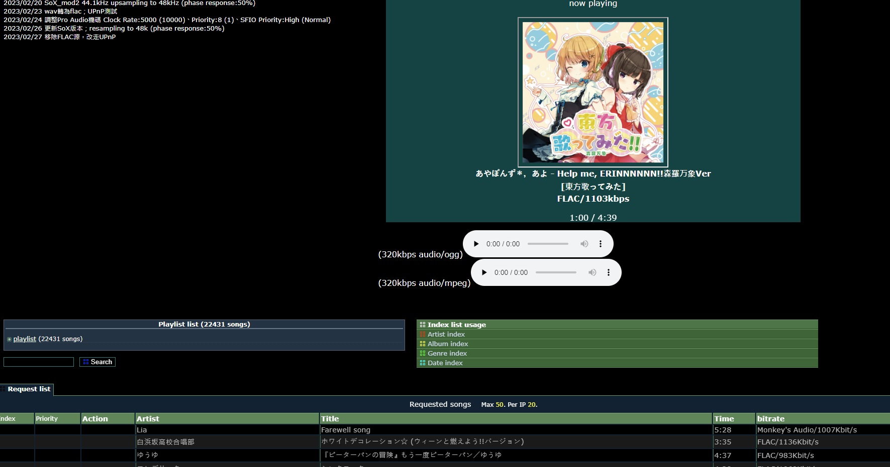

成品大概是這樣吧

<!--more-->

(有封鎖特定IP區段連入)

點歌台
http://tsuiokuyo.ddns.net:8763/js_index.html

狀態
http://tsuiokuyo.ddns.net:8764/status.xsl
(icecast)

http://tsuiokuyo.ddns.net:8765
(shoutcast)

2023/03/10 取封面平均色來改變背景色，本來是想實現頻譜會依封面而變色，不過有些平均不是很明顯，因此作罷，下一步估計是研究弄出動態歌詞，因為看到AVG遊戲大約的專輯量讓我感到絕望...，只能選擇逃避了。

2023/03/08 換成了上面那個畫面，本來想用Javascript version ( New! )這個畫面的，但想要有以前那種黑底風格因此換了個模板，也塞入了頻譜與進度條等等調整，只不過因為foobar引入js套件會出現問題，所以沒有甚麼新花樣。
搞得我連內嵌聊天室都辦不到...，在Javascript version ( New! )能辦到的事情，其他畫面都辦不到，估計是編譯的問題。

2023/03/07 花了一大段時間想辦法在網頁上塞入封面，因為串流的metadata不含圖片資訊，用foobar2000串流送出圖片資訊，這基本上完全沒有相關資料及討論，request_http沒有原始碼，反編譯重寫難度太高，所以只能去找其他元件來混用，
但因為別的元件是區網用的，在公網會有安全性問題，因此我取得後原始碼把一些功能移除，移除的難度就不大了，只是花了很多時間建置C++的環境來重新編譯dll檔...，實際上90%的時間就是花在建置環境，編譯完成後又遇到跨網域問題...。

以上的做法一段時間內不會放上來，因為有點麻煩，暫時也沒有心力來寫。

2023/02/24 修復換頁千分位錯誤，
<!--
<audio controls="controls" preload="none" __idm_id__="21979137"><source src="http://tsuiokuyo.ddns.net:8764/vorbis" type="application/ogg"></audio>


-->
<!-- ^^themes\LoveIt\layouts\shortcodes\audio.html -->

2022/12/15 補充
當前(v2.4.1)版本的ICECAST的FLAC尚不支援METADATA，難怪手機串流時能抓到METADATA，但是
官網那邊看不到，不過github看到有人提出問題過，才知道不是我的問題，不知何時才會支援，
而其他格式倒是正常，雖然這其實沒啥必要，只是看到這邊有顯示on Air的歌曲會比較爽一點
http://dir.xiph.org/search?q=tsuiokuyo

目前已不使用foo_shuicast，因為用shuicast在某些時候會有破音問題，因為只有hi-res跟mp3會破音，懷疑是跟歌曲本身的位元率高低有關，因此改用butt+vb audio cable來播放，這樣才不會接收到本機的音效，順便一提icecast的多個Genre 設定有固定格式，否則會直接送你異常，第二個以後的類型都要加, 才行，一定要用",空格"，如：Anime,  Jpop, Game，這爛分割方式讓我剛開始研究好久。

以下沒變

現在雖然都用google drive串流來聽歌，但不曉得哪一天無限空間會被拔掉，總要有幾個備援方案，

現在只有emby能當成備援而已，但emby不太可能支援小眾的無損壓縮格式，雖然無損壓縮互轉除非編碼有問題不然是會相同的，但我還是保留EAC時的格式，而且emby的app我覺得不是很好用，因此來玩玩看這個

此文為簡單的icecast v2.4.4 foobar2000 stream Components 以及 foo_request_http_v09-0.4說明

不過這些東西九成都已經過時了...教學都好幾年以前的產物了，而且連載點都很難找了，可惜的是PTT的foo_request_http_v09-0.4_fix版我倒是真的找不到了，所以那邊只能自己用懶人改法了，
不過這也是因為我只想在windows用foobar直接推送的關係，不然現在還有很多其他更方便的軟體...。

而選擇使用icecast的原因則單純只是因為它支援FLAC格式串流，目前Shoutcast看起來似乎不支援flac的樣子，我也不確定，我也懶得去測...，兩個電台的插件操作方式是一樣的，就改個選項而已。

目前手邊的無損格式至少有六種，WAV、FLAC、APE、TAK、TTA、M4A(ALAC)，本想說大不了全部轉為FLAC而已，不過看來是可以靠foobar自己轉碼成FLAC推送(?)

首先先提以下四個插件

foo_streamer，版本:v141(2015)，選單位於view -> streaming client，可以看到目前傳輸的位元率、目前在線的用戶端、以及播放歷史，對我來說最有用的就是看位元率吧，很直觀就能了解我確實是在推送FLAC，但換歌時，網頁(用戶)端會自動暫停播放音樂，這個真不能忍，不過我倒是沒特別去研究解決方法，且因為metadata沒有自動推送也是原因之一，在Icecast states沒辦法看到目前播放的音樂名稱，因此放棄。

foo_vorbisstream_fix3，版本:v1.1_fix3(2013)，選單位於設定 -> dps管理器中，這個應該是問題最少的了，而且在Icecast states**可以**看到目前播放的音樂，但是他沒辦法調整推送的編碼，但既然叫Vorbis，裡面的編碼大概也是Vorbis了，所以我也只能放棄。

foo_edcast，版本:v3.1.23(2009)，我的foobar2000版本過高(1.6.10)，直接掰掰

foo_shuicast，版本:v0.47(2018年)，選單位於設定 -> dps管理器，其實這個介面我不太喜歡，鑒於上面幾個我都有意見，那麼也只能用這個了，亂碼似乎改個UTF-8就行了，反正也不能弄到目前播放的音樂，只不過這個可選編碼，網頁(用戶)端又不會自動暫停，我還能說甚麼。

順便一提 
插件內選用quality的話，0=64,1=80,2=96,3=112,4=128,5=160(kbps)，能到多高，我就不知道了

foobar2000設定大概就這樣而已，再來是icecast2(v2.4.4)部分

官網下載安裝完成後，到根目錄簡單的調整icecast.xml

基本上較重要的大概只有

<admin-user> <admin-password> 網頁端管理員登入用

<source-password> foobar2000推送用密碼

 <port>根據需求改port

<hostname>

<directory> 可否收錄在icacast2 中

其實xml檔提供的註解還挺充實的，雖然我是靠翻譯看的

剩餘如<location> <admin>僅用於前端顯示，有能力的倒也能直接去改xsl檔

由localhost:port/status-json.xsl能看到推送的資料，有能力的也能去改DLL檔...

改完後執行icecast.bat啟動icecast後記得到foobar插件內connect

就能到localhost:8000、127.0.0.1:8000看看icecast是否正常以及測試播放

而掛載點則為http://localhost:8000/stream.ogg，也就是插件內的mountpoint路徑

預設是stream，就是這個電台的檔案名稱，能直接讀取它

弄上實體IP或動態域名後

基本上支援串流的軟體應該都能直接吃這串路徑來聽歌，應該啦。

順便一提，這掛載點如果直接進入時有IDM或其他下載器，瀏覽器開啟後可能會變成下載ogg檔。

最後就是有bug的foo_request_http點歌插件了...，選單位於設定 -> 工具 -> request http

basic settings頁面

畫面沒甚麼好說的就是port不要互衝，模板路徑選好，要播放的歌曲放進public playlist內

勾選Update when requests changed

再來是more settings頁面

Admin Settings: 設定遠端http登入foobar控制，預設是全鎖
右邊的三選項是下載選項，

1.Allow download in public playlist

2.Allow in upload playlist

3.Allow in play history

設定如下
完全不允許下載 => 三個都別勾
只允許下載別人上傳的 => 勾2和3
所有都可以下載 => 勾1和3
Enable Upload:允許別人可上傳音樂,看你要不要開啟

Search format: 設定搜尋時尋找歌曲的那些資訊

Use fast search: 不要勾，這個搜尋模式有BUG會讓電台當掉

Max song view: 歌單單頁顯示最大歌曲數

Max request num: 最大點歌數

Max request per ip: 每人最大點播歌曲數

Max search result num: 搜尋數量上限

當搜尋到的結果量到達這個數量就會強制停止
減輕伺服器負擔
Index threshold: 條目歌曲下限，當同專輯或歌手歌曲少於這個數量，
就不會出現在專輯或歌手歌單裡。
設為0就是所有歌全部都編到條目裡。

Song history num: 歷史紀錄的歌曲數量，當被點過的歌還在歷史紀錄上，
就不能再次點同首歌。

Sub list item num: 系統預先選歌的數量

Priority per IP: 每個人點歌的權重

Priority per time: 當前面的點播歌曲播完，已點的歌增加的權重

Max priority: 歌曲最大權重
 (權重越大的歌曲播放越優先)
 
Debug Requst: 除錯

Deny Proxy: 防止Proxy來的連線，安全和點播上的顧慮，可以勾起來

到點擊start後 status會從offline變成online，屆時就能進去localhost:xxxx測試了，

有個明顯的bug就是所有的列表換頁功能無法使用，也就是沒去修bug的話Playlist list只能顯示前100筆

Javascript version ( New! ) <s>看起來還未完成，不能用</s>

2023/02/24，我發現光是這個找歌部分就比flat好上幾百倍了，

但如要改用這個的話，還要想辦法美化，因為畫面真的空的

有看到網友改的，起初還看不出來是的模板，也是塞進去一些東西

不過這東西，有機會再去改吧

恩，有機會......

畢竟我只是用來自己聽的，所以才選擇flat，而且現在都考慮走UPnP了...

Simple version

還不錯的畫面

song file uploader，這個沒甚麼好提的

Javascript version ( 2 column )

Javascript version ( flat )

後弄成以下這樣，不過我已經棄用了

基本上會選擇的大概就是Simple version、2 column 、 flat 三擇一後並自己調整了

至於bug部分 PTT倒是有人也提供解法啦，雖然改好的檔已經沒了，但問題點都已經有指出來了，有點懶得去碰它...

https://www.ptt.cc/bbs/WebRadio/M.1296124848.A.E0A.html

https://ptt.healtyman.xyz/?man/WebRadio/D766/D6CE/M.1296145083.A.AB6.html

既然已知是參數問題，

所以我倒是沒改那麼多，直接用懶人方式調整

僅僅在requester.js中多加三行讓他的列表能夠正常運作而已

.replace(',','')已直接補進去，100這個數值需要同時調整前端，所以沒在這裡直接調整

<code>

  updateFromThis: function(element, params, isFocus, isBackground) {

​    **params = params.replace('_song_id=', '&song_id=')**

​    **page = params.substring(params.lastIndexOf('=') + 1, params.length)**

​    **params += '&page=' + page.replace(',','') / 100**

​    var p = element;

​    for (; p != null; p = p.parentNode) {

​      logDebug(p);

​      if (Element.hasClassName(p, 'tab_item')) break;

​    }
</code>

第一行是把傳入的參數修正，

第二行是取得他要查詢的N筆資料，

第三行是把那N筆轉成頁數，

大概是這樣

其他bug如果有遇到就再說了

2023/02/24 修正頁數千分位異常，以及分頁改foobar2000獲取
由
<code>
**params += '&page=' + page / 100**
</code>
這部分已經直接在上面改了就是補上.replace(',','')去除千分位而已而已

再來就是把那個最大檢視數量改由foobar2000拿取而不是寫死，不然分頁會有點小小的問題
<code>
***maxView = document.getElementById("maxView").innerText***
**params += '&page=' + page.replace(',','') / maxView**
</code>

另外到前端中FOOBAR2000-Info的tag隨便找個地方塞進%max_song_view%這個參數
例如
<code>
    View# $if(%playlist_name%, %playlist_name% ,  $if(%search_text%, " %search_text% " search result, %index_id%)) 
	
    &nbsp; 
	***顯示筆數：%max_song_view% ***
	Page: %current_page%
    
</code>

