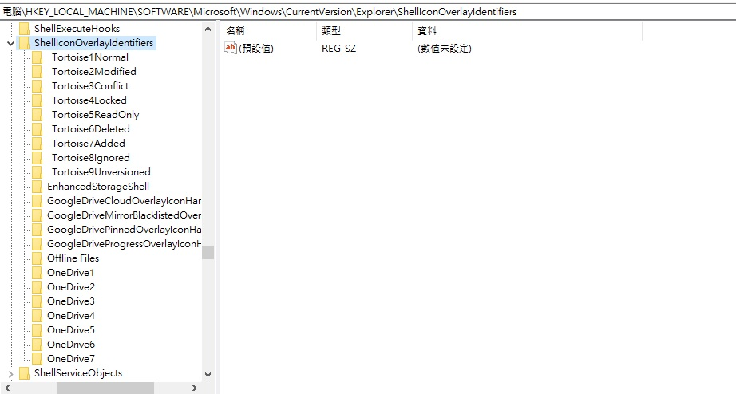
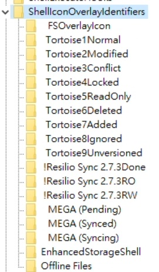

資料夾的小圖示消失的主因是

微軟的OverlayIcon限制前15個問題，而且還無法增加數量，只能調整位置...

懶人包:

開啟regedit.exe (登錄編輯程式)後，路徑到

**HKEY_LOCAL_MACHINE\SOFTWARE\Microsoft\Windows\CurrentVersion\Explorer\ShellIconOverlayIdentifiers**

在將Tortoise系列或是其他需要小圖示的程式名弄到前面即可，

只是加入多個空白鍵就會變得很難看就是了

也將其他資料夾的檔名刪除空白鍵，或是將Tortoise資料夾加個!或是 ATortoise 都行，

反正只要將它放置在前15個即可。

而如果之後又加入了其他會有小圖示的程式，似乎會自動將自己的登錄檔資料夾前面再加一個空白鍵，讓自己保證安裝後會有圖示。

完成之後到工作管理員重新啟動 windows檔案總管(explorer.exe)即可。
