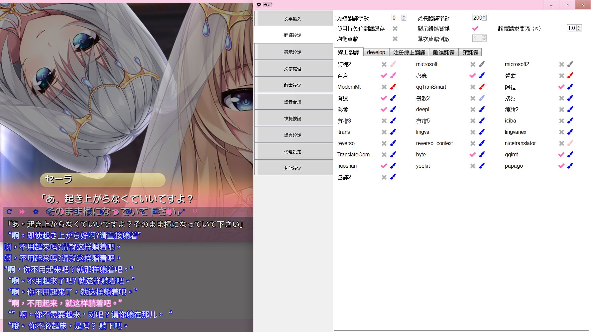



本文無教程及下載點，但大多有提供github或官網(如有存活)，畢竟一個一個試挺花時間的，再寫教程就太痛苦了，基本上github內都有教程，冷門的還請自行google方法



目前玩過的HGAME還真不少，但比起CG圖，老實說文本跟遊戲性比較讓我有興趣...

實際上會有這篇文是因為這幾天在玩huggingface的開源模型，想用來翻譯遊戲，畢竟chatgpt API有限制，也可能哪天就不能用

不過幾乎沒有特化日翻中的模型且參數量13B的模型無法即時運算，

根本不可能用於遊戲，最終決定，先乖乖地用翻譯API就好了...

然後就把硬碟或書籤的這些雜物整理一下 

嘛，總之現在有一堆雲翻補丁就是透過翻譯API這樣弄出來的，

有時候還得要看原文才會知道在講甚麼就是了，

更別說是日文這種會忽略語素以及縮詞等等，容易導致翻譯看不懂

也因此無法看上下文的翻譯品質大多都不會很高，再加上是遊戲，難免會有作者自創的片假名英文以及很難翻譯的梗之類的。

本文開始

遊戲大致分為3種好了，畢竟主要會用的就是三種，使用教學則請自己進入網站看了，

基本上除了galgame(AVG)，我會用的就是下面這兩個，因為AVG遊戲還是需要有精翻官中才會比較有帶入感，畢竟AVG主要還是看劇情。

這一篇以一般人為基準，指無台胞證、中國手機號碼、無國外信用卡、不花錢等等。

畢竟許多API無法簡單取得

僅提供官網、github或作者發布區，沒有毒、安全疑慮還請自行判斷

此文無直接提供使用教學，因為github裡面都有，google也有許多人分享教學，

而且這數量要我弄教程太痛苦了。

基本上我都有在win10(build 19045.3324)的環境底下一一測試過了。

# 

# 

### 

## 

## 

### 

## 

### 

## 

## 

## 

## 

## 

## 

## 

## 

## 

 

# 
