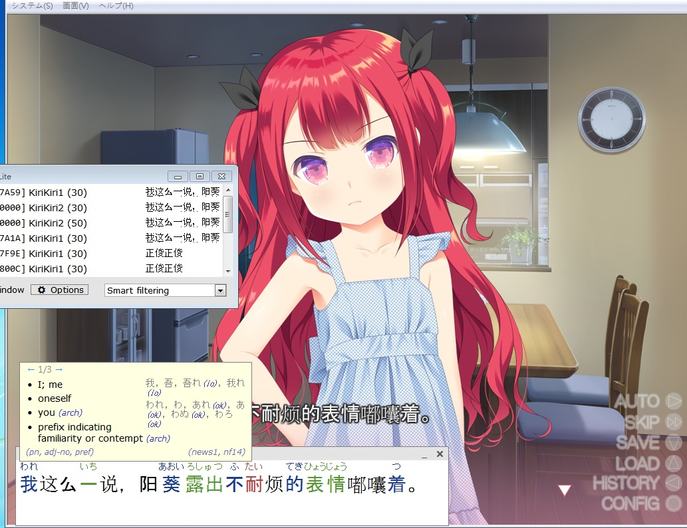



本文無教程及下載點，但大多有提供github或官網，基本上github內都有教程，冷門的還請自行google方法



https://forum.gamer.com.tw/C.php?bsn=60599&snA=42844

巴哈的版本會比較新且比較好閱讀，因為兩邊的排版方式不同，

這裡又因為布局的關係變更亂了，所以排版擺爛了，

會以巴哈那邊優先調整及更新，這邊就...看心情了。

實際上，我根本不需要這麼多種的翻譯程式...

有持續關注的也只有SakuraLLM模型

而因為我比較懶，玩都沒時間了還來寫文，有些接觸過的新東西也不一定會補上來，

再加上本文稍混亂且沒有實質教學，不會用的人還是需要再去爬文，

再再加上目前這些工具還是迭代很快，很容易就過時了，

基本上有後續更新的程式都會導入適用於openAI api 接口，

我也不會一一去更新下面內容，因此加入了當時的版本號及時間，

所以我建議可以先看這兩篇有後續更新以及教學的文章，本篇文章略過也無所謂

[【心得】遊戲&漫畫翻譯器使用心得及評測](https://forum.gamer.com.tw/Co.php?bsn=60599&sn=144224)

[【密技】LunaTranslator 用中文翻譯遊玩Steam上歐美遊戲及Galgame 更新:Rpgmaker跟Unity的引擎也適用Luna翻譯](https://forum.gamer.com.tw/C.php?bsn=60599&snA=41884)

此畫面更新紀錄

(2024/08/12)
3.29 VNLauncher (中國網友開發的galgame管理、紀錄時長及翻譯工具)

(2024/07/25)
3.28 renpy-translator
3.25 翻译姬 (純文字檔翻譯用)

(2024/07/03)
這兩個比較適用於自製漢化補丁
KeywordGacha (搭配LLM，翻譯前統一及替換專有名稱的工具)
GalTransl-7B-v1.5 (LLM模型，用於直接翻譯遊戲內腳本文字)

(2024/06/11)
Qwen2 (LLM模型，用途類似 Sakura-13B-Galgame)
我等了好久終於開源了...
不過在這個帖子中，能說的用途只有英翻中一種

(2024/03/22)
3.27 projz_renpy_translation
(2024/02/27)補上一些無傷大雅的小資訊
3.26 RENPYTHIEF補充內容
3.21.1 OpenCC
3.23 EraTranslatorPlus
3.24 ERATranslateHelper

(2024/02/04)簡單補上一些資訊，
看來已經到了連LLM模型都要放上來的時候了...?
3.26 RENPYTHIEF
3.21 Sakura-13B-Galgame LLM模型
3.22 GalTransl

廢話區

目前玩過的HG還真不少...

實際上會有這篇文是因為這幾天在玩huggingface的開源模型，想用來翻譯遊戲，畢竟chatgpt API有限制，也可能哪天就不能用

不過幾乎沒有特化日翻中的模型且參數量13B的模型無法即時運算、品質不高，根本不可能用於遊戲，最終決定，先乖乖地用翻譯API就好了...。

以遊戲類型分類，我大致分為3種：unity、RPG、AVG，因為我主要會需要用到翻譯的遊戲多為這三種，而OCR這種幾乎所有遊戲都可用的翻譯軟體也一併放在AVG。

**文超長，因為我能找到的都有列出了，**

**但東西太多一樣會導致無接觸的人看不懂就是了**

**本文僅有提供官網、GITHUB或作者發布區的網址，有沒有毒等等的安全性疑慮請自行判斷，**

**此文章亦無提供使用教學，因為GITHUB裡大多都有，透過google也能找到許多教學文**

直接提供給懶人一種選擇

UNITY:XUnity.AutoTranslator

RPG:MTOOL

AVG:LunaTranslator/VNR

非上述類型的遊戲也可試試LunaTranslator的OCR翻譯功能

這一篇文章以一般人為基準，這是指無法正常拿到中國免費API、國外信用卡及不花錢等，

**基本上我都有在win10(build 19045.3324)的環境底下一一測試過了。**

但因為主要在意的是文本及翻譯功能，少數附加功能可能沒有特別注意就遺漏了。

雖然軟體很多樣性，能有各種選擇是一件很不錯的事情，

畢竟我和大家一樣也只是想玩某款遊戲，苦無沒有官方中文、看不懂才會去找翻譯工具

即使我全部都有測試過，但畢竟每個人會用的軟體其實也就特定幾款自己覺得好用的，

**因此實際上這篇我文章可能有遺漏，甚至是錯誤的部分，又或是作者其他的後續更新調整**

**這些地方就請依照Github等發布頁，以作者說明為主。**

# 1. unity相關

## 1.1加載器

你需要選擇其中一個來搭配Unity.AutoTranslator才可以翻譯

### 1.1.1BepInEx

[GitHub - BepInEx/BepInEx: Unity / XNA game patcher and plugin framework](https://github.com/BepInEx/BepInEx)

### 1.1.2MelonLoader

[https://melonwiki.xyz/#/?id=what-is-melonloader](https://melonwiki.xyz/#/?id=what-is-melonloader)

## 1.2 XUnity.AutoTranslator

[GitHub - bbepis/XUnity.AutoTranslator](https://github.com/bbepis/XUnity.AutoTranslator)

模組為英文介面

可直接用google、bing、papago翻譯

這是一個unity的翻譯模組，會直接取代畫面上的原文文字

留一下快捷鍵，因為久沒用就會忘記

實際上，我會用到的只有alt+ 0、1、T

ALT + 0：切換翻譯器。（那是零）
ALT + 1：可用來比對原文及譯文。
ALT + T：自動翻譯以及取消翻譯。

撰寫時的軟體版本號為 v5.3.0(2023/08/03)

# 2. RPG相關

## 2.1 MTOOL

***他會生成快速啟動用的BAT檔案及語言檔等，到你的遊戲資料夾中**

[爱发电 · 连接创作者与粉丝的会员制平台](https://afdian.net/a/AdventCirno?tab=feed)

可用於RPG Makers /Wolf RPG / TyranoBuilder / SRPG Studio / Kirikiri / SMILE GAME BUILDER / Bakin等遊戲，會直接取代畫面上的原文文字

可直接用google、bing翻譯，不過目前新版似乎因為google翻譯費用，因此被拔掉了

有條件的翻譯器則為彩雲、百度、有道、chatGPT

能夠直接把檔案拖曳進去即可知道是否支援，內含數值修改器，

通常我主要用來翻譯RPG、SLG遊戲

撰寫時的軟體版本號為 v647CF9F5 (2023/8/30)

### 2.1.1 mytrs1

**你不需要這個東西**

[GitHub - imboaba/mytrs1](https://github.com/imboaba/mytrs1)
[GitHub - stevetrs/mytrs1(網址失效)](https://github.com/stevetrs/mytrs1)

這個是拿mtool提取的文本去透過API翻譯

撰寫時的軟體版本號為 v2.3.1 (2023/07/29)

### 2.1.2 AiNiee-chatgpt

**你不需要這個東西**

[GitHub - NEKOparapa/AiNiee-chatgpt: 一款基于【mtool】或【Translator++】，chatgpt自动批量翻译工具，主要是用来翻译各种RPG游戏。](https://github.com/NEKOparapa/AiNiee-chatgpt)

同mytrs1，也是透過手動提取的文本翻譯。

撰寫時的軟體版本號為 v4.58.2 (2023/08/02)

## 2.2 Translator++

***需要修改到原文檔**

https://dreamsavior.net/translator-the-introduction/

內建簡中介面

可用於RPG Makers、Wolf RPG Editor、RenPy、KiriKiri、Unity(基於XUnity.AutoTranslator)

可直接用google翻譯

其他可用翻譯器則參考

https://dreamsavior.net/docs/translator/translator-engine/

不能拖曳檔案丟進去，需要自己判斷遊戲引擎，主要推薦用來翻譯RPG MAKER遊戲，畢竟RM遊戲幾乎一眼就認出來了，

要注意的是盡量不要導入腳本，錯誤的用法可能會導致遊戲卡死，基本上會自動略過不需翻譯的參數，但js及ruby腳本可能就會發生錯誤了

用來精翻倒是不錯，每個條目都有百分比能判斷翻譯到哪邊

撰寫時的軟體版本號為 v5.3.31

## 2.3 RPGMakerMVGame Hook patcher

***會注入所需程式進你的遊戲資料夾中**

https://ulmf.org/threads/rpgmakermvgame-hook-patcher-how-to-hook-rpg-maker-mv-games.8960/

這只是一個文本提取器，你需要搭配任何一個的剪貼簿翻譯的程式

撰寫時的軟體版本號為 v0.0.3.4

## 2.4 rpgmaker-mv-translator

**你不需要這個東西**

***需要修改到原文檔**

[GitHub - davide97l/rpgmaker-mv-translator: Automatic game data translator for RPGMaker-MV](https://github.com/davide97l/rpgmaker-mv-translator)

透過python去對各個json文本翻譯。

撰寫時的軟體版本號為 v2023/02/21

# 3. GALGAME(AVG)相關

有些是有支援OCR，你要拿去翻譯網頁遊戲或是其他程式都行。

當然也能夠拿去看原文字幕的影片，

實際上也是有人用OCR程式去翻譯MMORPG，

只要設定好且快捷鍵熟悉就能方便使用了，

例如這張是一個免費的網頁AVG遊戲，可以透過OCR去翻譯。

另外就是，如果使用HOOK抓文本，在遊戲中不想顯示出原文，那麼你也可以考慮調整翻譯板的顏色及透明度蓋過去。

## 3.1 LunaTranslator

 [GitHub - HIllya51/LunaTranslator: Galgame翻译工具，支持剪贴板、OCR、HOOK，支持40余种翻译引擎。Galgame translate tool , support clipboard / OCR/ HOOK, support 40+ translate engines.](https://github.com/HIllya51/LunaTranslator)

支援HOOK、OCR、剪貼簿翻譯

幾乎所有網路上主流的翻譯器都可直接使用

功能很多且很方便，翻譯文本顯示的調整自由度高

支援導入VNR共享字典，字典部份下一個程式(VNR)會說

支援辭書及Mecab，可顯示詞性、分詞、及雙擊查詢單詞，這個部份我以VNR的截圖呈現，

原文以顏色分類，詞性、漢字假名也能標註出，你很直觀的能理解這是滿實用的輔助用的學習工具

支援TTS語音，

如果單單只有支援各大翻譯器(例如google小姐)的語音，那這功能幾乎跟沒有一樣，

畢竟通常不會有人特意去聽各大翻譯器的機械語音吧。

但有支援VoiceRoid+、VoiceRoid2、VOICEVOX，這就有點意思了，

畢竟角色多且聲調皆不同，主要是拿來搭配日文且無語音的AVG，

自動產生語音的壞處大概就是旁白及內心話都會生成而很不習慣

稍微測試後 

1. VoiceRoid+ 我即使完全轉語系改也改unicode還是打不開，放棄測試。

2. VOICEVOX 

https://voicevox.hiroshiba.jp/

(目前有26位免費日文角色聲庫) v0.14.7

但可能是API呼叫的原因，約七秒才會發出語音，基本上算無法使用。

雖然直接用他的程式生成語音是幾乎即時的就是了，有機會再研究。

3. VoiceRoid2

跟翻譯是同一時間生成的，也就是說翻譯完成時，語音也已經在閱讀了

總之，下列其他的程式的功能性幾乎比不過這個。

基本上可取代VNR了

撰寫時的軟體版本號為 v2.28.0 (2023/08/30)

## 3.2 VNR

### 3.2.1 Visual Novel Reader

[Google Code Archive - Long-term storage for Google Code Project Hosting.](https://code.google.com/archive/p/annot-player/)

VNR一代因為停止維護，所以線上的翻譯API全滅了，能用的剩下離線翻譯

撰寫時的軟體版本號為 未知(2014/06/03)

### 3.2.2  Visual Novel Reader V2

V2版為使用俄羅斯伺服器

### 3.2.3 Visual Novel Reader V3

V3版使用中國伺服器

或者為離線版

這V2跟V3的最主要的差別讀取字典以及Hook用的特殊碼，

VNR有共享字典，這字典是用於各個熱心網友手動修正翻譯異常或錯誤，

如有哪個地方，翻譯不好、分割錯誤、人名錯譯未統一等等的問題，

如果剛好有其他熱心網友玩過這遊戲，那麼對方則可能會修正這個地方，

簡單的說就是可能有人工校正過。

而中國網友連國外大部分都會有異常，實際上我用V2更新共享字典6次也都失敗，V3版倒是一次就成功了，由圖可知目前有兩萬多筆翻譯紀錄

在目前LunaTranslator可以導入VNR的字典後，VNR的使用者大概就真的越來越少了。

實際上功能幾乎都已經給LunaTranslator給提純了，而且VNR對許多人來說應該算是很難使用或是不理解的工具

## 3.3 MisakaTranslator 御坂翻譯器

[GitHub - hanmin0822/MisakaTranslator: 御坂翻译器—Galgame/文字游戏/漫画多语种实时机翻工具](https://github.com/hanmin0822/MisakaTranslator)

支援HOOK、剪貼簿翻譯

預設OCR則需百度API

如要本地OCR則需另外安裝 **Tesseract**

可直接用google、小牛翻譯(可綁台灣號碼)

其他有條件的翻譯器則為

百度、騰訊、有道、彩雲、J北京、金山快譯、譯典通、DeepL、IBM、Yandex翻譯

翻譯文本的顏色、大小、字型、背景色皆可調

如果第一次沒辦法自動提取文本，則需要另抓MisakaHookFinder來手動操作

而第二次就可直接從MisakaTranslator啟動遊戲。

撰寫時的軟體版本號為 v2.12.2 (2023/02/11)

### 3.3.1 MisakaHookFinder 御坂Hook提取器

**你可能會需要這東西**

[GitHub - hanmin0822/MisakaHookFinder: 御坂Hook提取工具—Galgame/文字游戏文本钩子提取](https://github.com/hanmin0822/MisakaHookFinder)

用來撈HOOK的工具之一，也支援文本轉剪貼簿

可用來搭配一些無法提取HOOK以及OCR的程式

撰寫時的軟體版本號為 v1.1 (2020/05/20)

## 3.3  YUKI Galgame 翻譯器

[GitHub - project-yuki/YUKI: YUKI Galgame Translator](https://github.com/project-yuki/YUKI)

支援HOOK

需要手動修改config檔並重啟程式來調整要使用的API，

可直接用彩雲、Azure、百度翻譯

可調翻譯文本大小、間距、背景色

功能樸實實用

似乎停止更新了

撰寫時的軟體版本號為 v0.14.3 (2020/05/30)

## 3.4 visual-novel-translator

[https://vntranslator.carrd.co/](https://vntranslator.carrd.co/)

英文介面

支援HOOK、OCR、剪貼簿

可直接用google、deepL、papago、Bing翻譯

有條件則為

deepL(API)、Baidu、PROMT、IBM Waston

翻譯文本部分都可自由調整

翻譯速度體感慢了一點，他會顯示翻譯速度，0.5秒還是會有感

而HOOK部分則需另外安裝**TextractorCLI**

OCR部分則需另外安裝 **Tesseract**

但程式風格挺好看的

撰寫時的軟體版本號為 v0.7.2 (2023/08/21)

## 3.5  Textractor

[GitHub - Artikash/Textractor: Extracts text from video games and visual novels. Highly extensible.](https://github.com/Artikash/Textractor)

支援HOOK，文本轉剪貼簿

可直接用google、bing翻譯

其他有條件的翻譯器則為

DeepL

可調翻譯文本大小、顏色、字型、背景等等

沒有甚麼花俏的功能，中規中矩，實際上許多類似程式都是基於這個作品撈取HOOK

撰寫時的軟體版本號為 v5.2.0 (2022/01/31)

## 3.6 TsubakiTranslator

[GitHub - Isayama-Kagura/TsubakiTranslator: 一款Galgame文本翻译工具，支持Textractor/剪切板/OCR翻译](https://github.com/Isayama-Kagura/TsubakiTranslator)

支援HOOK、剪貼簿翻譯，而OCR我則會閃退

可直接用IBM、小牛翻譯(可綁台灣號碼)，

而BING、愛詞霸翻譯，但有點問題

其他有條件的翻譯器則為

阿里、百度、彩雲、CHATGPT、DEEPL、騰訊、火山、Yeekit翻譯

可調翻譯文本大小、顏色、字型、背景透明度

沒有甚麼特點，台灣可用的翻譯器太少了，

而且基本上你不會想要用IBM的，原因如下圖

撰寫時的軟體版本號為 v1.0.6.2 (2023/06/27)

## 3.7 VNREX

支援HOOK、OCR、剪貼簿翻譯

可直接用小牛翻譯

有條件的翻譯器則為百度API KEY、騰訊API KEY、彩雲API KEY、離線翻譯

而有道翻譯則沒有反應

可調翻譯文本大小、字型、顏色

撰寫時的軟體版本號為 v2.63 (2022/12/05)

## 3.8 團子翻譯器

[GitHub - PantsuDango/Dango-Translator: 团子翻译器 —— 个人兴趣制作的一款基于OCR技术的翻译器](https://github.com/PantsuDango/Dango-Translator)

只支援OCR

可直接用騰訊、百度、deepL、Bing、團子(自建翻譯器)、小牛(可綁台灣手機)

彩雲、有道翻譯似乎有點問題，而DeepL速度太慢，不好用

有條件則為

百度API、CHATGPT、有道API、火山、騰訊、彩雲、阿里

只用單一翻譯，跑出來的文本很奇怪，本來以為是OCR的問題，

但聽TTS生成的語音又完全沒有任何問題，換其他翻譯器也一樣

而用多個翻譯器時則會發生接收到上一次辨識的文字，

然後繼續使用都一直會是慢一輪的翻譯...

撰寫時的軟體版本號為 v4.5.7 (2023/08/14)

## 3.9 agent

**你不太需要這個東西**

[GitHub - 0xDC00/agent: Universal script based text hooker (powered by FRIDA)](https://github.com/0xDC00/agent)

算是比較特殊用途的文本提取器吧，使用js提取文本，

本來看他能提取PPSSPP的文本還蠻厲害的，測試後發現實際上似乎還是需要等作者寫出對應的專用腳本才行...

撰寫時的軟體版本號為 v0.1.3 (2023/01/11)

## 3.10 GalUpTs

***需遊戲解包**

***需要修改到原文檔**

[GitHub - Lilyltt/GalUpTs: 对已解包的Gal实现自动化翻译](https://github.com/Lilyltt/GalUpTs)

透過CHATGPT翻譯對json檔翻譯

撰寫時的軟體版本號為 v1.3.0 (2023/04/21)

## 3.11 18ACG翻譯姬

***需遊戲解包**

**你不太需要這個東西**

***會注入所需程式進你的遊戲資料夾中**

官網已死，

應該只支援renpy

翻譯API無明確告知

完全沒有任何花俏的功能，是直接替換文本呈現在畫面上的，可即時生成及預先生成，即時的速度很快，大概只有精翻才需要預先生成，

圖中左上角四個選項以及右下角視窗外的翻譯姬立繪都是注入後生成的，

那四個選項除了詞庫可以調整翻譯之外，基本上沒啥用，且無法選擇翻譯器

視窗外的翻譯姬只是裝飾，只是啟動時會有語音：歡迎主人

注入一次後，以後啟動遊戲就會自動啟動翻譯姬。

steam遊戲需要去根目錄用Locale-Emulator改編碼啟動遊戲，否則會亂碼，

另外就是Unicode轉換異常。

撰寫時的軟體版本號為 未知

## 3.12 EasyTranslation

**你不需要這個東西**

這跟18ACG翻譯姬是同個東西，不過這個有毒就不弄了

撰寫時的軟體版本號為 未知

## 3.13 ErogeHelper

**你不需要這個東西**

***會注入所需程式進你的遊戲資料夾中**

[GitHub - luojunyuan/ErogeHelper: A visual novel tool for win-tablet](https://github.com/luojunyuan/ErogeHelper)

免費API似乎都掛了，只剩小牛翻譯可直接用

Yeekit、baiduweb、雲譯、有道、google

有條件的翻譯器為

百度、彩雲、騰訊

可調翻譯文本大小

首先要說的是，作者重構的新版1.1.0.0功能完全不同，無法翻譯，要降到0.0.8.2版本才行

是透過Hook及剪貼簿運作，

有點意思的是它支援剪貼簿文本發送給本地端的deepL來進行翻譯，不過窗口焦點會被DeepL搶走。

而程式生成的翻譯文本則可固定在遊戲畫面上，

或者是與其他程式一樣一個小窗口單純顯示翻譯文本

撰寫時的軟體版本號為 v1.1.0.0(2023/06/08)

## 3.14 game2text

**你不需要這個東西**

[https://game2text.com/](https://game2text.com/)

這也是個比較特殊的程式，是透過螢幕分享的方式來呈現翻譯，單螢幕應該會很難使用，

從官網來看是想設計成玩遊戲學習日文用的程式，透過OCR讀取的資料還能存成ANKI字卡，不過我使用OCR都會變亂碼，因此只能用剪貼簿翻譯，而不會顯示進log中

雖然有papago，但我使用的時候查不到東西，因此基本上只能用google翻譯

**還有一件事情就是目標語言似乎被綁死為英文，不管我改成甚麼都只會翻譯成英文，**

撰寫時的軟體版本號為 v0.4.9 (2021/04/21)

## 3.15 TIny翻译肋手

**你不需要這個東西**

百度、有道、騰訊都需要API KEY，因此一般人用不了

撰寫時的軟體版本號為 v4.9D

## 3.16 HighQuality-GalgameTranslator

**你不需要這個東西**

[GitHub - umichan0621/HighQuality-GalgameTranslator](https://github.com/umichan0621/HighQuality-GalgameTranslator)

無法測試，我任何功能按了就閃退，看readme似乎也是個翻譯軟體，

似乎可直接用google

有條件的翻譯器為騰訊翻譯API。

撰寫時的軟體版本號為 v0.1.0 (2021/11/27)

## 3.17 LightWeight_VNR

***需要自行打包來執行**

**你不需要這個東西**

[GitHub - MasouShizuka/LightWeight_VNR: 实现对Galgame文本的抓取与翻译功能](https://github.com/MasouShizuka/LightWeight_VNR)

使用Textractor來提取文本，支援OCR

有條件的翻譯器是

離線有道辭典、百度翻譯API

不過我注入成功後並沒有任何回應，

剪貼簿有抓到文字但沒有輸出，最後只好放棄了

撰寫時的軟體版本號為 無版本號

## 3.18 Capture2Text

**你不需要這個東西**

[https://capture2text.sourceforge.net/](https://capture2text.sourceforge.net/)

純OCR轉文字

撰寫時的軟體版本號為 v4.6.3 (2022/03/19)

## 3.19 PCOT

**你不需要這個東西**

[ヌルポインターストライク](http://www.gc-net.jp/s_54/)

純OCR轉文字

撰寫時的軟體版本號為 v1.4.9 (2023/01/10)

## 3.20 javaFxVNR

**你不需要這個東西**

[GitHub - XHXJ/javaFxVNR: 一个基于javaFx与Tesseract的OCR光学识别软件,支持多区域识别,管理功能.可以监控区域翻译.](https://github.com/XHXJ/javaFxVNR)

基於OCR透過百度API翻譯

實際上也有其他被埋沒的或持續更新的翻譯器，OCR居多，就不一一列出了

## 3.21 Sakura-13B-Galgame LLM模型

**你不需要這個東西

這是一個LLM模型，LunaTranslator支援使用，
也能搭配text-generation-webui用在MTool，

特化於galgame的一個中日翻譯的模型，有點意思，
用日文輕小說稍微與GPT3.5比對了一下
sakura、GPT3.5>有道>百度
當時測試的版本為sakura-13b-lnovel-v0.9b-Q8_0.gguf

目前當然還有些問題，但未來如果繼續發展不夭折，
我個人認為這將比GPT3.5更適合使用在二次元的文本上，
前提是你最低需要有一張24GB的顯示卡

當然你也能降低翻譯的品質，找其他量化版本，
或是找其他參數量的LLM，例如7B，甚至4B的模型來進行翻譯。

而英翻中也能使用Qwen1.5-14B等等搭配text-generation-webui來玩玩。

https://github.com/SakuraLLM/Sakura-13B-Galgame

撰寫時的版本號為 20240303-Qwen1.5-14B-v0.10pre0

# Qwen2 LLM模型

較適合英翻(簡)中
https://github.com/QwenLM/Qwen2

# GalTransl-7B-v1.5 LLM模型

對adv遊戲的文本、腳本中的行內換行等符號有較好的保留能力。
簡單的說就是比較適合用來自製翻譯補丁。
https://huggingface.co/SakuraLLM/GalTransl-7B-v1.5

# KeywordGacha

搭配LLM用的統一作品內的名詞的工具，比較適用於翻譯前替換文字
https://github.com/neavo/KeywordGacha
撰寫時的版本號為 KeywordGacha_DEV_20240702_161945

## 3.21.1 OpenCC

**你不需要這個東西

如果這個模型看不慣簡體字還能再搭配openCC實現簡體字轉台灣化功能，
但是stream模式下會影響到生成速度，
但如果是全部生成完成後再一次轉換則生成速度不會有太大影響

https://github.com/BYVoid/OpenCC/

撰寫時的版本號為 20240111-v0.9b

## 3.21.2 SakuraTranslator

我尚未測試
基於XUnity.AutoTranslator和Sakura模型的Unity遊戲翻譯
https://github.com/fkiliver/SakuraTranslator

## 3.21.3 RPGMaker_LLM_Translator

我尚未測試
基於Mtool和Sakura模型的RPGMaker遊戲翻譯
https://github.com/fkiliver/RPGMaker_LLM_Translator

## 3.22 GalTransl

內容待補

https://github.com/cx2333-gt/GalTransl

## 3.23 EraTranslatorPlus

**你不需要這個東西

https://github.com/trlaitioer/EraTranslatorPlus

只支援百度API，
這是純文字遊戲引擎(Eramaker、Emuera)用的，

感謝@gamer401告知此程式

撰寫時的軟體版本號為 v1.0.0 (2021/04/23)

## 3.24 ERATranslateHelper

**你不需要這個東西

這是純文字遊戲引擎(Eramaker、Emuera)用的，
只支援百度API...
內容待補...

https://github.com/mammothrider/ERATranslateHelper

## 3.25 翻译姬

**你不需要這個東西
*需遊戲解包

純文本機翻工具

https://gitee.com/this_sensen/NEKO_Print
撰寫時的軟體版本號為 v1.0.0.4

## 3.26 RENPYTHIEF

**你不需要這個東西

https://lion.craft.me/RenpyThief

我未測試，
用途和MTOOL類似
這東西其實2022年就有了
支援Unity、Renpy、RPGMaker MV、MZ。

補充內容
早期免費
現在"註冊"後，每日額度20000字內免費，更多則需收費。

收費是一回事，有個問題是
被B站網友注意到完全沒有遵守其他開源程式碼的授權條款，然後該網友就被拉黑了
Textractor的GPLv3開源協議未遵守，畢竟開源了他也不用收費了
而且連最簡單的MIT協議，只需要保留license檔案也沒有放
https://bbs.south-plus.net/simple/index.php?t2108205.html
作者回應
https://www.bilibili.com/read/cv31955854/

本文撰寫時的軟體版本號為 v3.9 (2024/01/31)

## 3.27 projz_renpy_translation

https://github.com/abse4411/projz_renpy_translation/

本文撰寫時的軟體版本號為 v0.4.2 (2024/03/14)

## 3.28 renpy-translator

https://github.com/anonymousException/renpy-translator

本文撰寫時的軟體版本號為 v2.4.4

## 3.29 VNLauncher

中國網友開發的galgame管理、紀錄時長及翻譯工具
看起來還不錯，不過目前還是初版，可能會有些bug

目前只支援百度翻譯及openAI API、TGW搭配本地模型

https://github.com/Minato302/VNLauncher

本文撰寫時的軟體版本號為 v0.9.3

# 4. 時代的眼淚

**下面的東西你全都不需要**

少數我確定win10已經無法直接使用，但win7、XP仍可使用

## 4.1  TranslationPendant

[GitHub - Hsing-Wei/TranslationPendant: Java在线翻译挂件](https://github.com/Hsing-Wei/TranslationPendant)

基於java開發，使用百度翻譯，

基本上一般人無法使用，因為裡面的百度API已經不同了，資料請求的方式也不同了，需要自己改原始碼。

介面是純簡體的，只是編譯的時候一直是GBK有亂碼，因此我弄成繁體字

他是透過抓剪貼簿的資料去翻譯的

撰寫時的軟體版本號為 v4.1 (2018/10/28)

下面這幾個是差不多的東西，都是文本提取，

花了點時間測試後，WIN10無法提取，但WIN7、XP都可以成功提取

## 4.2 ITH

[interactive-text-hooker](https://github.com/Erikhht/interactive-text-hooker)

撰寫時的軟體版本號為 v2.3 (2015/09/07)

## 4.3 ITHVNR

[GitHub - mireado/ITHVNR: feature/engine update for ITHVNR](https://github.com/mireado/ITHVNR)

撰寫時的軟體版本號為 3.5641.0-appha.1 (2016/12/15)

## 4.4 Anime Games Text Hooker(AGTH)

撰寫時的軟體版本號為 v2011.5.9

### 4.5 AGTH Assistant

撰寫時的軟體版本號為 v 1.1.0.0 (2009/01/19)

## 4.6 Cp2Tran

抓剪貼簿的資料並翻譯

## 4.7 GTGal

剪貼簿取得文本翻譯

不過目前測試抓不到資料

## 4.8 J北京、譯典通、金山快譯等等

都算是早期使用的離線翻譯，現在的都使用線上翻譯了

畢竟翻譯出來的品質還是有差。

## 4.9 喵翻

上面的整合體，也就是三件套 文本提取+ 剪貼簿+翻譯

撰寫時的軟體版本號為 v2014完結版

## 4.10 GAL同步翻譯工具

跟喵翻是差不多的東西

## 4.11 遊戲全自動翻譯機(*AGCPTSyS*)

跟喵翻是差不多的東西

## 4.12 寒風遊戲翻譯機

使用Office的OCR來翻譯

## 4.13 口罩翻译

***會注入DLL檔到你的遊戲資料夾中**

基於易語言開發

用於unity 32位元mono框架的遊戲翻譯，但我測試後倒是撈不到資料

撰寫時的軟體版本號為 v0.2

## 4.14 Chiitrans Lite

[Chiitrans Lite by alexbft](http://alexbft.github.io/chiitrans/)

英文介面

網路API已經全滅了

裡面有

ATLAS、BABYLON、EXCITE、GOOGLE、HONYAKU、SDL、SYSTRAN、Microsoft 

Меховой пончик(?)

無測試離線翻譯，也許可用用看，但不能選翻譯語言，只能日翻英

基於ITH提取文本，win10之後無法使用

Chiitrans及Chiitrans2

則為它的前身

一時之間找不到win7可執行又免轉碼的日文遊戲

因此用只能簡中來代替測試

撰寫時的軟體版本號為 v1.5.2 (2014/12/26)

 

# 5. 其他

## 5.1 程式轉語系，亂碼處理

Locale Emulator

[Locale Emulator](https://xupefei.github.io/Locale-Emulator/)

ver. 2.5.0.1(2021/8/26)

NTLEA 

[GitHub - zxyacb/ntlea](https://github.com/zxyacb/ntlea)

ver. Build 46(2018/06/17)

piaip applocale

win7用

## 5.2 簡體程式文字轉繁體工具

GalFC

## 5.3 簡體文字檔台灣用語化工具

繁化姬

https://zhconvert.org/

## 5.4 遊戲縮放工具

Magpie

[GitHub - Blinue/Magpie: An all-purpose window upscaler for Windows 10/11.](https://github.com/Blinue/Magpie)
