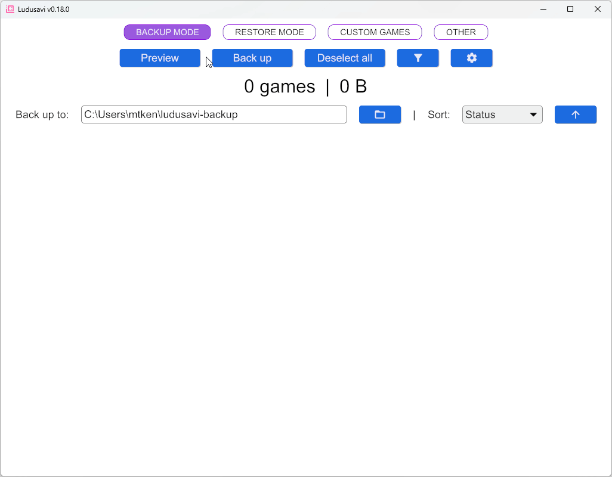
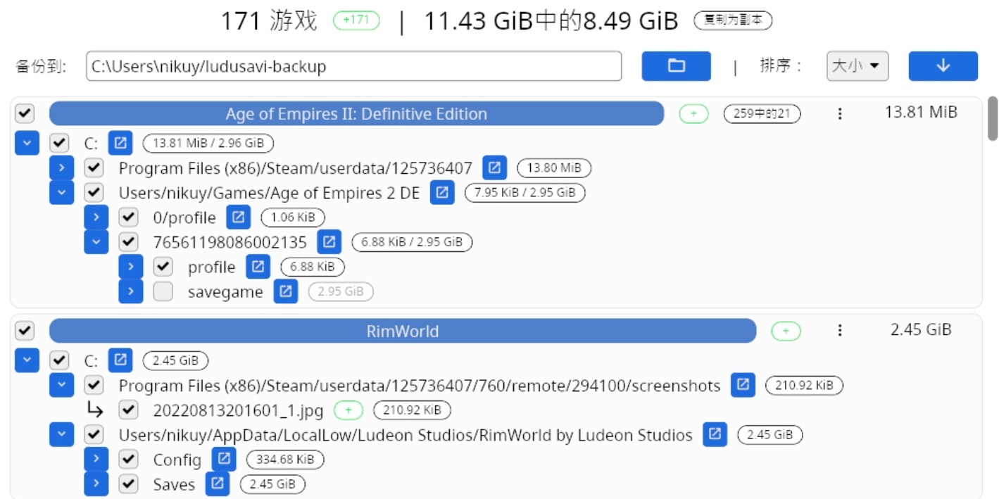
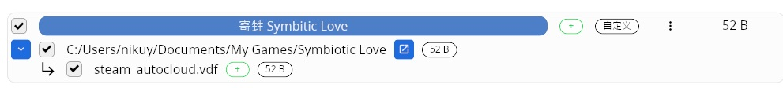
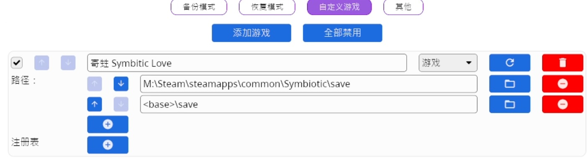
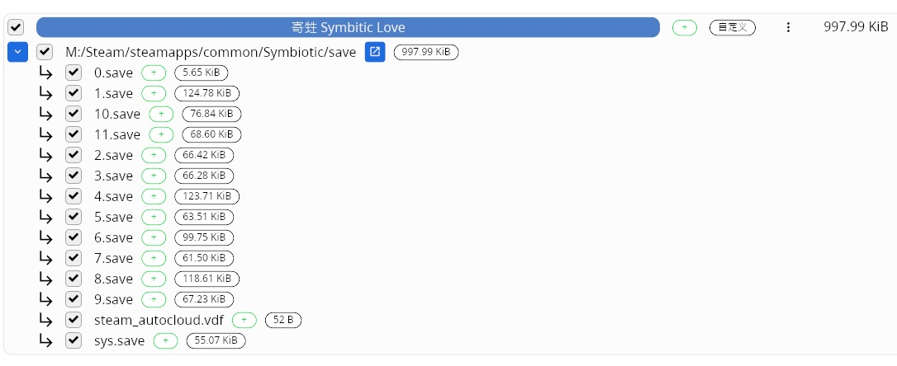
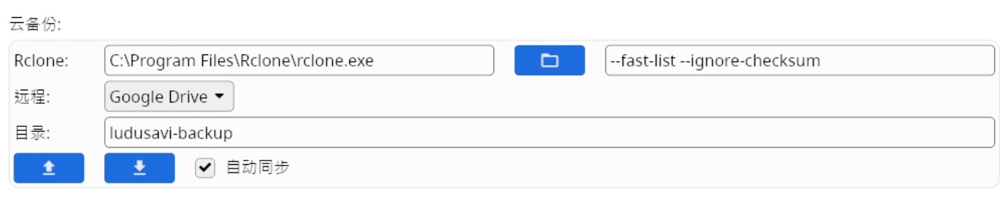
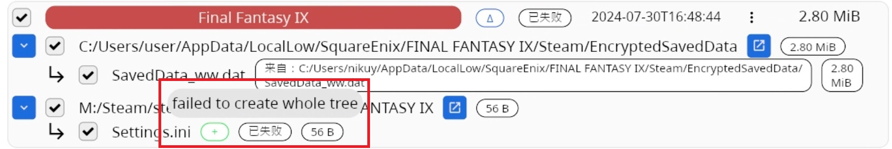



使用mklink對很多人不友善，因此簡單介紹Ludusavi 這個開源程式

本文圖少字多，這篇是提windows 10 與steam，其他的環境就要依靠別人了。



**Ludusavi 是一個開源的遊戲備份工具，
它是基於PCGamingWiki創建的遊戲條目來尋找目錄底下的遊戲。**

**支援多作業系統，因此steam deck、mac也能使用，但你要去其他地方爬文...，
支援多遊戲平台，且可備份的不只PC遊戲存檔，模擬器存檔也能備份，
也包括DRM-Free等單機遊戲也可透過設定根目錄或自訂路徑來備份存檔。**

畫面就直接拿原作者的demo圖比較快

**我首先要說一句，
任何操作都可能有遺失存檔的風險，因此風險需要自負，**

**即使只是備份也有存檔備份失敗的風險(沒有找到存檔或者未正確備份)，後續會提。**

**除非你已經確認過備份的存檔可以使用，沒有任何問題，
否則"還原"前，建議先手動直接複製貼上的現有的存檔資料以備不時之需，
不論是"主檔"的備份，還是"備份檔"的備份。**

下面內容雖然打很多，但其實不是很複雜。

## 下載

1. 首先你需要下載 **Ludusavi**

https://github.com/mtkennerly/ludusavi/releases/
windows系統要下載**ludusavi-win64.zip**

免安裝，他的設定檔會生成在%AppData%內，

可以直接丟在桌面，未來更新程式也可以直接覆蓋

2. 而如果要同步到雲端硬碟(google drive、one drive、自架伺服器或其他等)，

還需要另外下載**rclone**

(文中有另一種方法，可以看完再考慮要不要下載)

https://github.com/rclone/rclone/releases/
windows系統要下載**rclone-windows-amd64.zip**
建立一個資料夾將她解壓縮進去，後續會將路徑指定到他的exe檔

Ludusavi

開啟程式後應該會是英文，請先至右上角"OTHER"調整語言，而目前僅有簡中完成度最高，

繁中已弄完成，只不過還要等作者審核及更新，因為起初翻一些就覺得懶了，
只是這幾天有興致寫這篇文章時，順便去將它繁中部份補完了，
而大概有九成我是透過GPT再加上簡單人工修正。

不過翻譯時並不知道實際句子使用的位置，所以後續大概還要改一下中文描述，
如果有錯譯或不通順，可以提出來我有空再去修改，或你也可以直接去修正。

我將操作分成五個部份
**一、本機備份
二、上傳雲端
三、本機還原
四、不同電腦還原(重定向設定)
五、自動備份**

而文中某些操作會舉兩種例子，
我個人是都使用第二種。

## 一、本機備份

首先，看一下"**其他**"頁面
上方有個"**不備份這些平台上內建雲端儲存的遊戲**"選項，可以自行考慮，
我個人是不勾，因為有些遊戲顯示支援 steam雲端，但是卻不會儲存到雲端。

**下方有根目錄部分根據自行需求增加，而非屬內建的第三方平台、同人遊戲等也能增加，
但PCGamingWiki找不找的到就另說了。**

點選上方的"**備份模式**"，再來直接按下**預覽**吧，
上方會顯示找到的遊戲及存檔容量，

按下齒輪可以設定完整備份數量及差異備份數量，
差異備份只會備份後續有增修的存檔檔案，如果要保存多個備份檔會比較省空間。

備份路徑看你要放到哪裡，要直接存到雲端後續會提。

**預覽完成**後可能你可能會發現一些問題，可以善用篩選及排序功能，
篩選功能會判斷大小寫不同，比較麻煩點。

那麼我直接舉我注意到的問題吧

1. 存檔過大
   
   基本上就是存檔數過多或截圖太多的關係，
   不過主要發生在自動儲存會分成不同存檔的遊戲，
   正常來說一個遊戲存檔500M就算很大了，
   這部分就是很直觀的看你哪些不需要備份，直接取消勾選即可，如附圖
   

2. 沒有找到遊戲或存檔記錄明顯過小
   
   
   這個有三種可能，而這三個都會讓你還原失敗，畢竟確實沒有備份到...
   
   pcgamingwiki 沒有建立條目，
   或者路徑錯誤，
   本機的遊戲資料夾和pcgamingwiki的條目名稱不同，
   
   我下方圖中遊戲就是一個例子，
   
   遊戲名稱叫 Symbiotic Love 而 pcgamingwiki 也叫 Symbiotic Love
   
   但是steam幫我生成的資料夾叫 Symbiotic 因此會備份失敗。
   
   

這時有兩個選擇，
一、協助調整 pcgamingwiki 然後等待 Manifest更新，看起來更新排程是5小時/次
二、自定義修改路徑

從容量旁邊的...圖案點擊進自定義後，
再自己設定路徑，之後點擊右邊的重新整理的按鈕即可看到存檔。

順帶一提，他有提供很多的占位修飾符號(佔位符)可以方便使用，
不過不是很重要，因為可以直接用完整路徑。

舉個例子，圖中這兩個路徑的在程式裡是一樣的，

因為我不需要備份C槽的那個檔案，因此我圖片只設定save路徑

3. 在預覽中連遊戲都沒有找到
   
   一樣是從自訂模式手動加入路徑， 
   但是哪些遊戲缺少目前只能人工確認，
   簡單對比一下兩者的資料夾數量就大概知道有沒有缺了，
   如果你方便的話也能去PCGamingWiki造福大家，未來能自動找到了。

以上設定跟本機備份路徑都設定好就點擊**備份**吧。

**而認為重要的遊戲存檔建議人工再確認一下是否真的有備份到正確的存檔路徑，
熱門遊戲可能比較不會有問題，冷門遊戲就不好說了。**

## 二、上傳雲端

#### 例1、使用Ludusavi內建功能

首先請到"其他"頁面，找到rclone部分，設定好你的rclone.exe路逕，
然後選擇你所使用的雲端硬碟後，登入並許可授權。

(如果不小心關閉授權畫面的話，port可能會被占住，屆時直接重開機最快了)
授權完成之後，會多出上傳及下載按鈕，
點擊上傳按鈕你就會在雲端硬碟內看到備份路徑的存檔了，但是跑得很慢...。

你在備份路徑存檔的增刪，在上傳後也會影響到雲端硬碟內的增刪。

#### 例2. 利用 Google Drive for Desktop等工具

也能透過使用 Google Drive for desktop或各主流硬碟自己的同步程式、raidrive、rclone等等，能在本機生成的雲端硬碟路徑， 直接將其設定為備份的路徑。

這個比較直覺能直接開啟雲端資料夾確認，因此比較推薦這個。

## 三、本機還原

本機還原很簡單，點**還原模式**，設定備份位置後，**預覽**，還原，
如果有在齒輪設定多備份數量，則遊戲名稱右邊會有時間戳可以讓你更換。

還原失敗會變紅並在已失敗顯示錯誤原因，
點擊右方的藍色按鈕可以開啟他要還原的檔案位置，直接確認是否路徑錯誤等。

 

## 四、不同電腦還原(重定向設定)

他的路徑是由佔位符 + id等等組成的，
所以不管有沒有換機需求，都可以先設定好，
哪天電腦突然故障，也不用特意去找前一台電腦的路徑
未來換電腦也只要設定一次重定向就好。

但你還是要跑一輪備份，先知道存檔路徑，才好設定。

那麼，要先提我的場景，

A電腦
windows使用者帳戶叫 nikuy 
steam路徑為 C:/Program Files (x86)/Steam
遊戲路徑有 E:/SteamLibrary以及M:/Steam

B電腦 
使用者帳戶叫 user 
steam路徑為 C:/Program Files (x86)/Steam
遊戲路徑 D:/SteamLibrary

#### 例1. 直接導向

假設要在A電腦備份，B電腦還原

那麼在B電腦部分要在，"其他"頁面最下面的路徑重定向
增加"復原" 左邊為C:/Users/nikuy，右邊為 C:/Users/user
增加"復原" 左邊為E:/SteamLibrary，右邊為 D:/SteamLibrary
增加"復原" 左邊為M:/Steam，右邊為 D:/SteamLibrary

而A電腦則左右路徑反過來，
這是其中一個方法，
但是如果還有C、D電腦就會太麻煩，因此推薦使用例2。

#### 例2. 導向假路徑

先簡單說明一下，

我們會根據用戶名稱、遊戲檔案路徑，各自導到一個隨意的假路徑，
然後還原時，再根據各自的假路徑透過重定位還原到當前電腦實際路徑，

以下是一個範例

**A電腦**
增加"雙向" 左邊為C:/Users/nikuy，右邊為 C:/Users/XXXX
增加"雙向" 左邊為E:/SteamLibrary，右邊為 Z:/SteamLibrary
增加"雙向" 左邊為M:/Steam，右邊為 Z:/SteamLibrary

**B電腦**
增加"雙向" 左邊為C:/Users/user ，右邊為 C:/Users/XXXX
增加"雙向" 左邊為D:/SteamLibrary，右邊為 Z:/SteamLibrary

要注意的是路徑大小寫會有影響，會導致路徑錯誤。

## 五、自動備份

#### 例1. 原作者教的備份方式

透過windows內建的"工作排程器"呼叫Ludusavi定時備份， 簡單教學

首先在右側的選項中點擊"建立基本工作..."，
名稱及描述隨意，就填 "Ludusavi存檔備份"，
下一步 -> 執行時間看個人，就選"每天"，後面想要改每小時執行也可以，
下一步 -> 開始時間不修改
下一步 -> 啟動程式
下一步 -> 
瀏覽找你的 ludusavi.exe 完整位置，
新增引數 填入 backup --force
開始位置，留空
下一步 -> 完成

如此一來就會在特定時間自動備份了

#### 例2. 搭配使用 playnite，它能達到關閉遊戲後自動備份存檔，

**playnite** 是一個 開源的遊戲管理工具，他也可以自動導入其他平台遊戲，
只要簡單的設定，介面可以弄到和steam收藏庫八成的相似，
甚至能統計非steam遊戲的時數，當然，別人看不到。

不過這部分，但因為啟動遊戲變成要從playnite啟動，有人需要說明我後續再提吧。

順帶一提，搭配 playnite 用命令設定啟動參數，
應該也能做到類似同步雲端存檔(啟動遊戲前先透過啟動參數還原最新存檔)，
但就是麻煩，實用性不是很高，所以我沒去實驗。

至於存檔衝突，也就是A電腦有進度，但B電腦也有不同的進度，

還原會直接覆蓋過去，因此這部分只能依靠人工判斷了。

操作大概是這樣。

